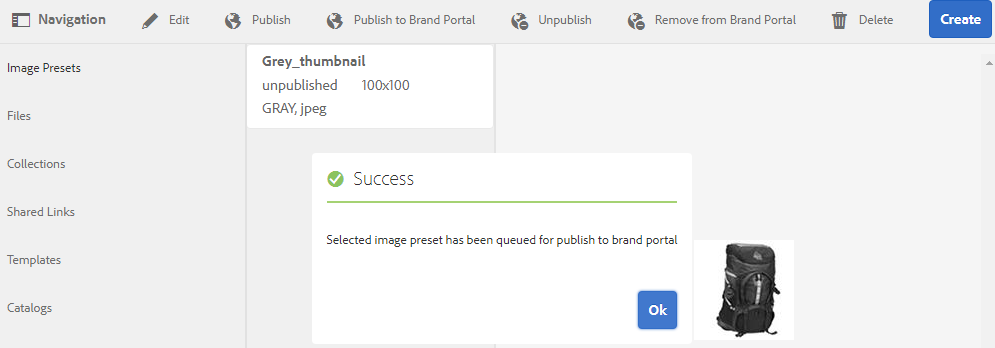
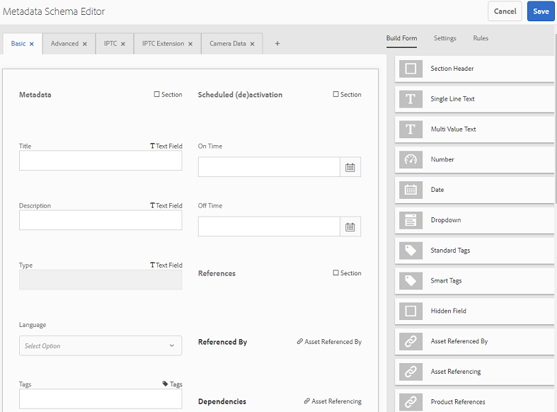
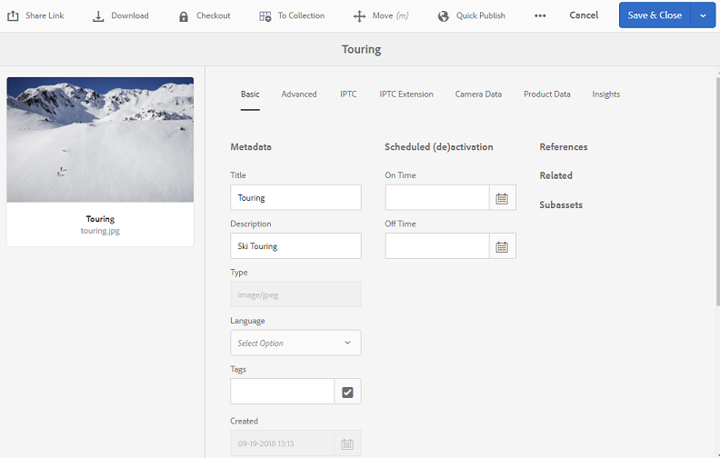
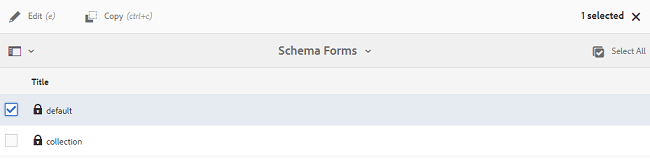
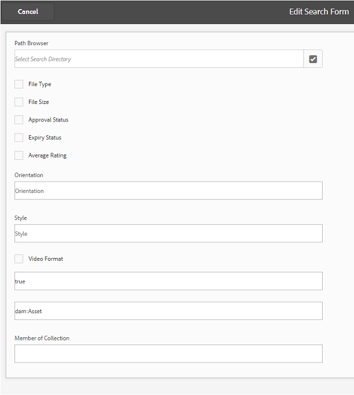
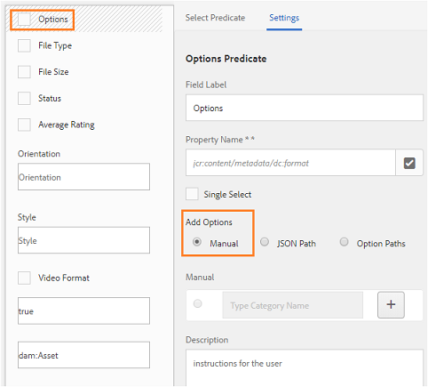

# Veröffentlichen von Vorgaben, Schemata und Facetten in Brand Portal {#publish-presets-schema-and-facets-to-brand-portal}

In diesem Artikel wird beschrieben, wie Vorgaben, Metadatenschemata und benutzerdefinierte Suchfacetten aus der AEM-Autoreninstanz in Brand Portal veröffentlicht werden. Mit den Veröffentlichungsfunktionen können Unternehmen die Bildvorgaben, Metadatenschemata und Suchfacetten wiederverwenden, die in der AEM-Autoreninstanz erstellt/geändert wurden. So wird der Aufwand für das Duplizieren verringert.

>[!NOTE]
>
>Die Funktion zum Veröffentlichen von Bildvorgaben, Metadatenschemata und Suchfacetten aus der AEM-Autoreninstanz in Brand Portal ist ab AEM 6.2 SP1-CFP7 und AEM 6.3 SP 1-CFP 1 (6.3.1.1) verfügbar.

## Veröffentlichen von Bildvorgaben in Brand Portal {#publish-image-presets-to-brand-portal}

Bildvorgaben sind eine Gruppe von Größenangaben und Formatierungsbefehlen, die zum Zeitpunkt der Bildbereitstellung angewendet werden. Bildvorgaben können in Brand Portal erstellt und geändert werden. Wenn eine AEM-Autoreninstanz im Dynamic Media-Modus ausgeführt wird, können Benutzer Vorgaben in der AEM-Autoreninstanz erstellen und in AEM Assets Brand Portal veröffentlichen. So wird verhindert, dass dieselben Vorgaben in Brand Portal doppelt erstellt werden.\
Nachdem die Vorgabe erstellt wurde, wird sie als dynamisches Ausgabeformat in der Asset-Ausgabeformatleiste und im Dialogfeld „Herunterladen“ angezeigt.

>[!NOTE]
>
>Wenn die AEM-Autoreninstanz nicht im **[!UICONTROL Dynamic Media-Modus]** ausgeführt wird (Kunde hat Dynamic Media nicht gekauft), wird das **[!UICONTROL PTIFF]**-Ausgabeformat (Pyramid TIFF) der Assets nicht zum Zeitpunkt des Uploads erstellt. Bildvorgaben oder dynamische Ausgabeformate funktionieren mit dem **[!UICONTROL PTIFF]**-Ausgabeformat eines Assets. Wenn die **[!UICONTROL PTIFF]**-Ausgabeformate also in der AEM-Autoreninstanz nicht verfügbar ist, ist sie auch in Brand Portal nicht verfügbar. Daher sind in der Ausgabeformatleiste der Asset-Detailseite und im Dialogfeld „Download“ keine dynamischen Ausgabeformate verfügbar.

Gehen Sie wie folgt vor, um Bildvorgaben in Brand Portal zu veröffentlichen:

1. Tippen oder klicken Sie in der AEM-Autoreninstanz auf das AEM-Logo, um auf die globale Navigationskonsole zuzugreifen. Klicken oder tippen Sie dann auf das Werkzeugsymbol und navigieren Sie zu **[!UICONTROL Assets > Bildvorgaben]**.
1. Wählen Sie in der Liste der Bildvorgaben eine oder mehrere Bildvorgaben aus und klicken/tippen Sie auf **[!UICONTROL In Brand Portal veröffentlichen]**.

>[!NOTE]
>
>Wenn Benutzer auf **[!UICONTROL In Brand Portal veröffentlichen]** klicken, werden die Bildvorgaben zur Veröffentlichung in die Warteschlange gestellt. Benutzern wird empfohlen, anhand des Protokolls der Replikationsagenten zu überprüfen, ob die Veröffentlichung erfolgreich war.

Gehen Sie wie folgt vor, um die Veröffentlichung von Bildvorgaben in Brand Portal rückgängig zu machen:

1. Tippen oder klicken Sie in der AEM-Autoreninstanz auf das AEM-Logo, um auf die globale Navigationskonsole zuzugreifen. Klicken oder tippen Sie dann auf das **[!UICONTROL Werkzeugsymbol]** und navigieren Sie zu **[!UICONTROL Assets > Bildvorgaben]**.
1. Wählen Sie eine Bildvorgabe aus und wählen Sie oben die Option **[!UICONTROL Aus Brand Portal löschen]** aus.

## Veröffentlichen des Metadatenschemas in Brand Portal  {#publish-metadata-schema-to-brand-portal}

Im Metadatenschema sind das Layout und die Eigenschaften beschrieben, die auf der Eigenschaftenseite von Assets/Sammlungen angezeigt werden.

 

Wenn Benutzer das Standardschema in der AEM-Autoreninstanz bearbeitet haben und es als Standardschema in Brand Portal verwenden möchten, können sie die Metadaten-Schemaformulare einfach in Brand Portal veröffentlichen. In einem solchen Szenario wird das Standardschema in Brand Portal durch das Standardschema überschrieben, das über die AEM-Autoreninstanz veröffentlicht wurde.

Wenn Benutzer ein benutzerdefiniertes Schema in der AEM-Autoreninstanz erstellt haben, können sie das benutzerdefinierte Schema in Brand Portal veröffentlichen, anstatt dort dasselbe Schema noch einmal zu erstellen. Benutzer können dieses benutzerdefinierte Schema auf jeden Ordner und jede Sammlung in Brand Portal anwenden.

>[!NOTE]
>
>Standardschemata können nicht in Brand Portal veröffentlicht werden, wenn sie in der AEM-Instanz gesperrt sind (d. h. unbearbeitet sind).

>[!NOTE]
>
>Wenn auf einen Ordner in der AEM-Instanz ein Schema angewendet wird, muss das gleiche Schema auch in Brand Portal vorhanden sein, damit die Seite „Asset-Eigenschaften“ in der AEM-Autoreninstanz und in Brand Portal konsistent ist.

Gehen Sie wie folgt vor, um ein Metadatenschema aus der AEM-Autoreninstanz in Brand Portal zu veröffentlichen:

1. Tippen oder klicken Sie in der AEM-Autoreninstanz auf das AEM-Logo, um auf die globale Navigationskonsole zuzugreifen. Tippen oder klicken Sie dann auf das Werkzeugsymbol und navigieren Sie zu **[!UICONTROL Assets > Metadatenschemata]**.
1. Wählen Sie ein Metadatenschema aus und wählen Sie oben die Option **[!UICONTROL In Brand Portal veröffentlichen]** aus.

>[!NOTE]
>
>Wenn Benutzer auf **[!UICONTROL In Brand Portal veröffentlichen]** klicken, werden die Metadatenschemata zur Veröffentlichung in die Warteschlange gestellt. Benutzern wird empfohlen, anhand des Protokolls der Replikationsagenten zu überprüfen, ob die Veröffentlichung erfolgreich war.

So machen Sie die Veröffentlichung eines Metadatenschemas in Brand Portal rückgängig:

1. Tippen oder klicken Sie in der AEM-Autoreninstanz auf das AEM-Logo, um auf die globale Navigationskonsole zuzugreifen. Tippen oder klicken Sie dann auf das Werkzeugsymbol und navigieren Sie zu **[!UICONTROL Assets > Metadatenschemata]**.
1. Wählen Sie ein Metadatenschema aus und wählen Sie oben die Option **[!UICONTROL Aus Brand Portal löschen]** aus.

## Veröffentlichen von Suchfacetten in Brand Portal {#publish-search-facets-to-brand-portal}

Suchformulare stellen Benutzern in Brand Portal die Funktion [Facettensuche](../using/brand-portal-search-facets.md) bereit. Die Suchfacetten ermöglichen detailliertere Suchen in Brand Portal. Alle dem Suchformular [hinzugefügten Eigenschaften](https://experienceleague.adobe.com/docs/experience-manager-65/assets/administer/search-facets.html) sind für Benutzer als Suchfacetten in Suchfiltern verfügbar.

Wenn Sie das benutzerdefinierte Suchformular **[!UICONTROL Asset-Admin-Suchschiene]** aus der AEM-Autoreninstanz verwenden möchten, ist es nicht notwendig, dasselbe Formular in Brand Portal erneut zu erstellen. Stattdessen können Sie das angepasste Suchformular aus der AEM-Autoreninstanz in Brand Portal veröffentlichen.

>[!NOTE]
>
>Das gesperrte Suchformular **[!UICONTROL Asset-Admin-Suchschiene]** aus AEM Assets kann nicht in Brand Portal veröffentlicht werden, es sei denn, es wurde bearbeitet. Sobald dieses Suchformular bearbeitet und in Brand Portal veröffentlicht wurde, wird damit das Suchformular in Brand Portal überschrieben.

Gehen Sie wie folgt vor, um die bearbeitete Suchfacette aus der AEM-Autoreninstanz in Brand Portal zu veröffentlichen:

1. Tippen/klicken Sie auf das AEM-Logo und navigieren Sie zu **[!UICONTROL Tools > Allgemein > Suchformulare]**.
1. Wählen Sie das bearbeitete Suchformular und **[!UICONTROL In Brand Portal veröffentlichen]** aus.

   >[!NOTE]
   >
   >Wenn Benutzer auf **[!UICONTROL In Brand Portal veröffentlichen]** klicken, werden Suchfacetten zur Veröffentlichung in die Warteschlange gestellt. Benutzern wird empfohlen, anhand des Protokolls der Replikationsagenten zu überprüfen, ob die Veröffentlichung erfolgreich war.

So machen Sie die Veröffentlichung von Suchformularen in Brand Portal rückgängig:

1. Tippen oder klicken Sie in der AEM-Autoreninstanz auf das AEM-Logo, um auf die globale Navigationskonsole zuzugreifen. Tippen oder klicken Sie dann auf das Werkzeugsymbol und navigieren Sie zu **[!UICONTROL Allgemein > Suchformulare]**.
1. Wählen Sie das Suchformular und oben die Option **[!UICONTROL Aus Brand Portal löschen]** aus.

>[!NOTE]
>
>Beim **[!UICONTROL Rückgängigmachen der Veröffentlichung in Brand Portal]** bleibt in Brand Portal das Standardsuchformular erhalten. Das letzte vor der Veröffentlichung verwendete Suchformular wird nicht wiederhergestellt.

### Beschränkungen {#limitations}

1. Nur wenige Sucheigenschaften können nicht für Suchfilter in Brand Portal verwendet werden. Wenn diese Sucheigenschaften als Teil des Suchformulars aus der AEM-Autoreninstanz in Brand Portal veröffentlicht werden, werden sie herausgefiltert. Benutzer sehen daher eine geringere Anzahl von Eigenschaften in dem Formular, das in Brand Portal veröffentlicht wurde. Weitere Informationen finden Sie in der [Liste aller verwendbaren Sucheigenschaften in Brand Portal](../using/brand-portal-search-facets.md#list-of-search-predicates).

1. Wird bei der [!UICONTROL Options-Eigenschaft] ein benutzerdefinierten Pfad verwendet, um Optionen in der AEM-Autoreninstanz zu lesen, funktioniert dies in Brand Portal nicht. Diese zusätzlichen Pfade und Optionen werden nicht mit dem Suchformular in Brand Portal veröffentlicht. In diesem Fall können Benutzer die Option **[!UICONTROL Manuell]** unter **[!UICONTROL Optionen hinzufügen]** in der **[!UICONTROL Options-Eigenschaft]** auswählen, um diese Optionen manuell zu Brand Portal hinzuzufügen.

