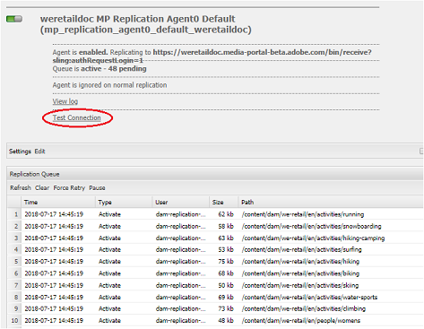

# Beheben von Problemen beim parallelen Veröffentlichen in Brand Portal {#troubleshoot-issues-in-parallel-publishing-to-brand-portal}

[!DNL Brand Portal] unterstützt die Integration mit [!DNL AEM Assets] genehmigten Marken-Assets, die nahtlos aus der Autoreninstanz von AEM Assets erstellt (oder veröffentlicht) werden. Once [integrated](https://helpx.adobe.com/experience-manager/6-5/assets/using/brand-portal-configuring-integration.html), [!DNL AEM] Author uses a replication agent to replicate the selected asset(s) to [!DNL Brand Portal] cloud service for approved usage by [!DNL Brand Portal] users. Multiple replication agents are used [!DNL AEM 6.2 SP1-CFP5], [!DNL AEM CFP 6.3.0.2], and onwards to allow high-speed parallel publishing.

>[!NOTE]
>
>Adobe recommends upgrading to [!DNL AEM 6.4.1.0] to ensure that [!DNL AEM Assets Brand Portal] is successfully integrated with AEM Assets. A limitation in [!DNL AEM 6.4] gives an error while configuring integration with Brand Portal and replication fails.

Beim Konfigurieren des Cloud-Dienstes für das Markenportal unter [!UICONTROL /etc/cloudservice]werden alle erforderlichen Benutzer und Token automatisch generiert und im Repository gespeichert. Die Cloud-Dienstkonfiguration wird erstellt, Dienstbenutzer, die für Replizierungs- und Replizierungsagenten erforderlich sind, werden ebenfalls erstellt, um Inhalte zu replizieren. Hierbei werden vier Replikationsagenten erstellt. So when you publish numerous assets from [!DNL AEM] to [!DNL Brand Portal], these are queued and distributed among these replication agents through Round Robin.

However, publishing can fail intermittently due to- large sling jobs, increased Network and Disk [!UICONTROL I/O] on [!DNL AEM] Author instance, or slowed performance of [!DNL AEM] Author instance. Es wird daher empfohlen, die Verbindung mit den Replizierungsagenten zu testen, bevor sie mit dem Veröffentlichen beginnen.

## Beheben von Problemen bei der ersten Veröffentlichung: Überprüfen der Veröffentlichungskonfiguration {#troubleshoot-failures-in-first-time-publishing-validating-your-publish-configuration}

So validieren Sie Ihre Veröffentlichungskonfigurationen:

1. Überprüfen Sie die Fehlerprotokolle.
2. Überprüfen Sie, ob der Replikationsagent erstellt wurde.
3. Testen Sie die Verbindung.

**Beim Erstellen des Cloud-Diensts**

Prüfen Sie die Protokollfragmente. Überprüfen Sie, ob der Replikationsagent erstellt wurde oder nicht. Wenn die Erstellung des Replikationsagenten scheitert, bearbeiten Sie den Cloud-Dienst, indem Sie geringfügige Änderungen am Cloud-Dienst vornehmen. Überprüfen Sie, ob der Replizierungsagent erstellt wurde oder nicht. Falls nicht, bearbeiten Sie den Dienst erneut.

Wenn der Cloud-Dienst beim wiederholten Bearbeiten nicht richtig konfiguriert ist, melden Sie sich ein Tagesticket an.

**Testen der Verbindung zu Replikationsagenten**

Sehen Sie sich das Protokoll an. Wenn im Replikationsprotokoll Fehler gemeldet werden:

1. Wenden Sie sich an den Adobe Support.

2. Retry [clean-up](../using/troubleshoot-parallel-publishing.md#clean-up-existing-config) and create publish configuration again.

<!--
Comment Type: remark
Last Modified By: Mini Gulati (mgulati)
Last Modified Date: 2018-06-21T22:56:21.256-0400

?? check and compare public key. At times public key is different

?? another thing to check in /useradmin

-->

### Vorhandene Veröffentlichungskonfigurationen in Brand Portal bereinigen {#clean-up-existing-config}

In den meisten Fällen, wenn die Veröffentlichung nicht funktioniert, kann der Grund dafür liegen, dass der Benutzer, der die Veröffentlichung durchführt (mac-&lt; tenantid &gt;-replication) nicht über den neuesten privaten Schlüssel verfügt und die Veröffentlichung mit "401 nicht autorisiert" fehlschlägt und in den Protokollen des Replizierungsagent keine weiteren Fehler gemeldet werden. Möglicherweise möchten Sie eine Fehlerbehebung vermeiden und stattdessen eine neue Konfiguration erstellen. Damit die neue Konfiguration ordnungsgemäß funktioniert, sollten Sie Folgendes aus der AEM-Authoring-Einrichtung bereinigen:

1. [!UICONTROL localhost: 4502/crx/de] (angenommen, Sie führen die Autoreninstanz auf [!UICONTROL localhost aus: 4502]):\
   i delete [!UICONTROL /etc/replication/agents.author/mp_replication &amp; # 42];\
   ii delete [!UICONTROL /etc/cloudservices/mediaportal/ &lt; config_ name &amp; gt];

2. [!UICONTROL localhost: 4502/useradmin:]\
   ich suche nach dem Benutzer [!UICONTROL mac-&lt; tenantid &gt;-replication]\
   ii löschen diesen Benutzer

Jetzt wird das gesamte System bereinigt. Jetzt können Sie versuchen, eine neue  cloudservice  config and still use the already existing [!DNL JWT] application in [https://legacy-oauth.cloud.adobe.io/](https://legacy-oauth.cloud.adobe.io/). Es ist nicht notwendig, eine neue Anwendung zu erstellen. Stattdessen muss einfach nur der öffentliche Schlüssel in der neu erstellten Cloud-Konfiguration aktualisiert werden.

## Problem mit der Sichtbarkeit der Developer Connection-JWT-Anwendung {#developer-connection-jwt-application-tenant-visibility-issue}

Wenn auf [!UICONTROL https://legacy-oauth.cloud.adobe.io/](https://legacy-oauth.cloud.adobe.io/), alle Orgs (Mandanten), für die die aktuellen Benutzer Systemadministrator sind, aufgelistet werden. Wenn Sie den Organisationsnamen hier nicht finden oder Sie eine Anwendung für einen erforderlichen Mandanten hier nicht erstellen können, überprüfen Sie, ob Sie über ausreichende (Systemadministrator-)Rechte hierfür verfügen.

Für diese Benutzeroberfläche gibt es ein bekanntes Problem, dass nur die obersten 10 Anwendungen sichtbar sind. Wenn Sie die Anwendung erstellen, bleiben Sie auf dieser Seite und erstellen Sie ein Lesezeichen für die URL. Sie müssen nicht zur Auflistungsseite der Anwendung wechseln und die von Ihnen erstellte Anwendung suchen. Sie können diese mit Lesezeichen versehene URL direkt erreichen und die Anwendung bei Bedarf aktualisieren/löschen.

The [!DNL JWT] application might not be listed appropriately. Daher wird empfohlen, beim Erstellen der JWT-Anwendung ein Lesezeichen für die URL zu setzen oder sie sich zu notieren.

## Laufende Konfiguration funktioniert nicht mehr {#running-configuration-stops-working}

<!--
Comment Type: draft

If the running configuration stops working, either of the following two possibilities
<g class="gr_ gr_15 gr-alert gr_gramm gr_inline_cards gr_run_anim Grammar multiReplace" data-gr-id="15" id="15" style="font-size: 12px;">
are
</g> there:

1.
<g class="gr_ gr_14 gr-alert gr_gramm gr_inline_cards gr_run_anim Grammar only-ins doubleReplace replaceWithoutSep" data-gr-id="14" id="14">
Connection
</g> has failed, or

2. Publish has failed with permission to dam-replication-service denied, while connection has passed 

If the connection has failed [1], the
<g class="gr_ gr_10 gr-alert gr_spell gr_inline_cards gr_run_anim ContextualSpelling ins-del multiReplace" data-gr-id="10" id="10">
fail safe
</g> way to fix it is to <a href="../using/troubleshoot-parallel-publishing.md#main-pars-header-1664955658">clean up</a> the existing Brand Portal publish configuration and recreate a publish configuration. 

However, if the
<g class="gr_ gr_18 gr-alert gr_spell gr_inline_cards gr_run_anim ContextualSpelling" data-gr-id="18" id="18">
publish
</g> has failed with
<g class="gr_ gr_16 gr-alert gr_gramm gr_inline_cards gr_run_anim Grammar only-ins doubleReplace replaceWithoutSep" data-gr-id="16" id="16">
permission
</g> denied to dam-replication-service, raise a support ticket.

-->

Wenn ein Replikationsagent, mit dem das Veröffentlichen in Brand Portal bisher korrekt funktionierte, keine Veröffentlichungsaufträge mehr verarbeitet, prüfen Sie die Replikationsprotokolle. [!DNL AEM]In ist eine Funktion zur automatischen Wiederholung integriert. Wenn das Veröffentlichen eines bestimmten Assets scheitert, wird automatisch ein Wiederholungsversuch gestartet. Wenn ein temporäres Problem aufgetreten ist, z. B. ein Netzwerkfehler, kann eine Wiederholung erfolgreich sein.

Wenn jedoch kontinuierliche Fehler beim Veröffentlichen auftreten und die Warteschlange blockiert ist, sollten Sie „Verbindung testen“ wählen und versuchen, die dort gemeldeten Fehler zu beheben.

Based on the errors, you are advised to log a support ticket, so that [!DNL Brand Portal] engineering team can help you resolve issues.
