# Neue Funktionen in Experience Manager Assets Brand Portal {#what-s-new-in-aem-assets-brand-portal}

Mit Adobe Experience Manager Assets Brand Portal können Sie problemlos genehmigte Kreativ-Assets abrufen, kontrollieren und sicher an externe Parteien und interne Geschäftsbenutzer auf allen Geräten verteilen. Brand Portal ermöglicht eine effizientere Asset-Freigabe, schnellere Time-to-Market für Assets sowie verringerte Risiken von Nicht-Compliance und unbefugtem Zugriff. Adobe arbeitet an der Verbesserung des allgemeinen Brand Portal-Erlebnisses. Nachfolgend erfahren Sie, welche Funktionen und Erweiterungen eingeführt werden.

## Änderungen in Version 2022.02.0 {#what-changed-in-Feb-2022}

Brand Portal 2022.02.0 ist eine interne Version, mit der kritische Probleme behoben werden: Weitere Informationen finden Sie in den aktuellen [Brand Portal-Versionshinweisen](brand-portal-release-notes.md).

## Änderungen in Version 2021.10.0 {#what-changed-in-october-2021}

Brand Portal 2021.10.0 ist eine interne Version, mit der kritische Probleme behoben werden: Weitere Informationen finden Sie in den aktuellen [Brand Portal-Versionshinweisen](brand-portal-release-notes.md).

## Änderungen in Version 2021.08.0 {#what-changed-in-august-2021}

Brand Portal 2021.08.0 ist eine interne Version, in der Geschäftsprofile für Unternehmens- und Team-Kunden eingeführt werden, um Organisationen eine bessere Kontrolle über ihre Assets zu ermöglichen. Die Benutzer verfügen jetzt über organisationsspezifische Berechtigungen für die neuen und migrierten Organisationen. Während der Migration werden alle bestehenden Adobe ID-Konten zu Business IDs migriert.

* Business IDs gelten für alle neuen und bestehenden Organisationen, sobald sie migriert sind.
* Für Business IDs ist keine spezielle Einrichtung erforderlich, wie z. B. die Beanspruchung einer Domain oder die Einrichtung von Single-Sign-on.
* Sie können Benutzer mit beliebigen E-Mail-Adressen hinzufügen, einschließlich öffentlicher E-Mail-Domains wie gmail.com oder outlook.com.

**Auswirkungen auf die Brand Portal-Benutzer**

Die Migration hat keine Auswirkungen auf Ihren vorhandenen Datensatz, Ihre Assets, Benutzer oder Einstellungen. Die einzige interne Änderung, die während der Migration vorgenommen wird, ist die Berechtigung Ihrer bestehenden Organisation für Geschäftsprofile.

>[!NOTE]
>
>Geschäftsprofile gelten derzeit für neue Organisationen, die nach dem 16. August 2021 erstellt werden.
>
>Bis zur Migration Ihrer Organisation können Sie weiterhin Adobe ID-, Enterprise ID- oder Federated ID-Typen verwenden, um auf die Organisation zuzugreifen.

### Referenzartikel {#reference-articles}

* [Einführung in Adobe-Profile](https://helpx.adobe.com/de/enterprise/kb/introducing-adobe-profiles.html)

* [Verwalten von Adobe-Profilen](https://helpx.adobe.com/de/enterprise/using/manage-adobe-profiles.html)

* [Aktualisierung des Anmeldeerlebnisses für Benutzer und Administratoren](https://helpx.adobe.com/de/enterprise/using/storage-for-business.html#new-admin-sign-in-exp)

* [Anmeldebeschränkung während der Migration](https://helpx.adobe.com/de/enterprise/kb/account-temporarily-unavailable.html)

* [Verwalten von Benutzern in der Admin Console](https://helpx.adobe.com/de/enterprise/using/manage-users-individually.html)

* [Verwalten von Produktprofilen für Enterprise-Benutzer](https://helpx.adobe.com/de/enterprise/using/manage-product-profiles.html#assign-users)

* [Domain-Vertrauen](https://helpx.adobe.com/de/enterprise/admin-guide.html/enterprise/using/set-up-identity.ug.html#directory-trusting)

<!--   
### Add new users to T2E organization   {#add-users-to-T2E-org}

On adding a new user in Admin Console for a new or migrated T2E organization, the user will have to perform an additional step **Join Team** to get entitled to the T2E organization. 

The user is entitled only if the user chooses to **Join Team**, otherwise the user won't get access to the selected T2E organization in Brand Portal. 

>[!NOTE]
>
>The workflow is not applicable to the existing Brand Portal users.

### Additional screen while navigating to Admin Console   {#navigate-to-admin-console}

The administrators will have to perform an additional step of selecting the T2E organization while navigating from Brand Portal to Admin Console. The workflow applies on the new and migrated T2E organizations.   

Selection of the T2E organization is a one-time activity and is not required everytime the administrator navigates from Brand Portal to Admin Console.

1. Log in to a T2E organization in Brand Portal as administrator.
1. Go to **[!UICONTROL Tools]** > **[!UICONTROL Users]** > **[!UICONTROL Management]** and click on the link **[!UICONTROL Launch Admin Console]**. 

   Or, go to **[!UICONTROL Unified Shell]** > **[!UICONTROL Administration]** and click on the link **[!UICONTROL Launch Admin Console]**. 
1. Search the T2E organization to login to Admin Console.

   

### Restriction during migration of an organization   {#login-restriction}

When an organization is undergoing T2E migration, the users of that organization will not be able to login to Brand Portal. The following error message appears on the screen. However, the migration won't impact the active user session until the token expires. 

Once the migration is complete, the users can login to Brand Portal. The users will receive an email notification containing the entitlement changes. If the users are entitled to more than one organization, they will have to select the organization at the time of login. 
-->

<!--
For a new or migrated T2E orgnization, the users will have an organization specific entitlement. A user can have multiple entitlements with the same email id for different T2E organizations. 
-->

## Änderungen in Version 2021.06.0 {#what-changed-in-june-2021}

Brand Portal 2021.06.0 ist eine interne Version, mit der kritische Probleme behoben werden: Weitere Informationen finden Sie in den aktuellen [Brand Portal-Versionshinweisen](brand-portal-release-notes.md).

## Änderungen in Version 2021.02.0 {#what-changed-in-feb-2021}

Brand Portal 2021.02.0 ist eine Erweiterungsversion, die den Brand Portal-Aktivierungs-Workflow für AEM Assets as a Cloud Service einführt, die Asset-Beschaffungsfunktion für AEM Assets as a Cloud Service vereinfacht, den Asset-Download verbessert und kritische Fehler behebt. Damit können die Administratoren auch das Standard-Download-Verhalten von Ordnern, Sammlungen und den Massen-Download von Assets auf Mandantenebene konfigurieren. Der **[!UICONTROL Verwendungsbericht]** in Brand Portal wurde auch geändert und spiegelt nun die aktiven Brand Portal-Benutzer wider.

### Aktivieren von Brand Portal in AEM Assets as a Cloud Service {#bp-automation-on-cloud-service}

AEM Assets as a Cloud Service kann jetzt eine vorkonfigurierte Brand Portal-Instanz enthalten. Der Cloud Manager-Benutzer kann Brand Portal auf der AEM Assets as a Cloud Service-Instanz aktivieren.

Früher wurde AEM Assets as a Cloud Service manuell mit Brand Portal über Adobe Developer Console konfiguriert.

Der Cloud Manager-Benutzer löst den Aktivierungs-Workflow aus, der die erforderlichen Konfigurationen im Backend erstellt und Brand Portal auf derselben IMS-Org wie die AEM Assets as a Cloud Service-Instanz aktiviert.

So aktivieren Sie Brand Portal auf Ihrer AEM Assets as a Cloud Service-Instanz:

1. Melden Sie sich bei Adobe Cloud Manager an und gehen Sie zu **[!UICONTROL Umgebungen]**.
1. Wählen Sie die Umgebungen (einzeln) aus der Liste aus. Sobald Sie die Umgebung gefunden haben, die mit Brand Portal verbunden ist, klicken Sie auf die Schaltfläche **[!UICONTROL Brand Portal aktivieren]**, um den Aktivierungs-Workflow zu starten.
1. Sobald der Brand Portal-Mandant aktiviert ist, ändert sich der Status in „Aktiviert“.

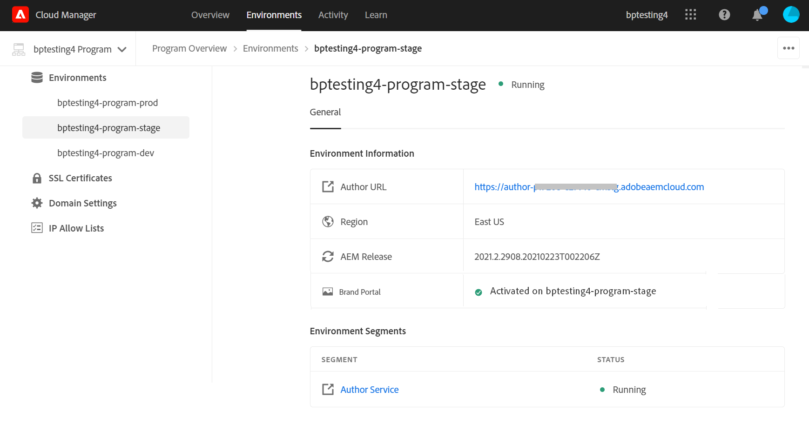

Siehe [Aktivieren von Brand Portal in AEM Assets as a Cloud Service](https://experienceleague.adobe.com/docs/experience-manager-cloud-service/assets/brand-portal/configure-aem-assets-with-brand-portal.html?lang=de).

### Asset-Beschaffung in AEM Assets as a Cloud Service {#asset-sourcing-on-cloud-service}

Die Asset-Beschaffungsfunktion wird jetzt in AEM Assets as a Cloud Service unterstützt. Die Funktion ist standardmäßig für alle Cloud Service-Benutzer aktiviert. Die zulässigen Brand Portal-Benutzer können zur Asset-Beschaffung beitragen, indem sie neue Assets in die Beitragsordner hochladen und diese von Brand Portal in AEM Assets as a Cloud Service veröffentlichen. Die Administratoren können die Beiträge der Brand Portal-Benutzer überprüfen und genehmigen, um sie weiter an andere Brand Portal-Benutzer zu verteilen.

Zuvor war die Asset-Beschaffung nur in AEM Assets (On-Premise und Managed Service) verfügbar.

Siehe [Asset-Beschaffung in Brand Portal](https://experienceleague.adobe.com/docs/experience-manager-brand-portal/using/asset-sourcing-in-brand-portal/brand-portal-asset-sourcing.html?lang=de).

### Asset-Download {#asset-download-setting}

Zusätzlich zu den vorhandenen **[!UICONTROL Download-Einstellungen]** können die Brand Portal-Administratoren jetzt die Einstellung **[!UICONTROL Asset-Download]** konfigurieren. Mit dieser Einstellung können die Administratoren das Standard-Download-Verhalten von Ordnern, Sammlungen und den Massen-Download von Assets (mehr als 20 Assets) auf Mandantenebene steuern.

<!--
Earlier, all the asset renditions were directly downloaded in a zip folder in case of folder, collection, and bulk download of assets. As the **[!UICONTROL Download]** dialog is skipped for folders or collections, there was no mechanism to control the downloading behaviour of the assets. Due to this, the users were finding it difficut to search for a particular asset rendition from a folder containing huge bunch of downloaded renditions. 
-->

Zuvor wurden alle Asset-Ausgabedarstellungen direkt in einen ZIP-Ordner heruntergeladen. Das Dialogfeld **[!UICONTROL Herunterladen]** wurde für Ordner und Sammlungen übersprungen. Es gab keine Methode zur Steuerung des Asset-Download-Verhaltens, sodass es schwierig war, in einer großen Anzahl von Downloads nach einer bestimmten Ausgabedarstellung zu suchen.

Die Einstellung **[!UICONTROL Asset-Download]** bietet jetzt die Möglichkeit, beim Herunterladen von Ordnern, Sammlungen oder beim Massen-Download von Assets für jedes Asset einen eigenen Ordner zu erstellen.

Wenn die Einstellung **[!UICONTROL Asset-Download]** deaktiviert ist, werden die Ordner oder Sammlungen in einen ZIP-Ordner heruntergeladen, der alle Asset-Ausgabedarstellungen im selben Ordner enthält, mit Ausnahme des Downloads der Assets über den Freigabe-Link.

Melden Sie sich bei Ihrem Brand Portal-Mandanten als Administrator an und navigieren Sie zu **[!UICONTROL Tools]** > **[!UICONTROL Download]**. Die Administratoren können die Einstellung **[!UICONTROL Asset-Download]** aktivieren, um beim Herunterladen von Ordnern, Sammlungen und beim Massen-Download von Assets für jedes Asset einen eigenen Ordner zu erstellen.

Siehe [Herunterladen von Assets aus Brand Portal](https://experienceleague.adobe.com/docs/experience-manager-brand-portal/using/download/brand-portal-download-assets.html?lang=de).
<!--
### Download using Share link {#download-using-share-link}

The default behavior of downloading the assets using share link is now independent of the **[!UICONTROL Download Settings]**. A separate folder is created for each asset while downloading the assets using share link. 
-->

### Verwendungsbericht {#usage-report}

Der **[!UICONTROL Verwendungsbericht]** in Brand Portal wurde geändert, sodass er nur die aktiven Brand Portal-Benutzer widerspiegelt. Die Brand Portal-Benutzer, die keinem Produktprofil in der Admin Console zugewiesen sind, gelten als inaktive Benutzer und werden im **[!UICONTROL Verwendungsbericht]** nicht angezeigt.

Zuvor wurden sowohl aktive als auch inaktive Benutzer im Verwendungsbericht angezeigt.

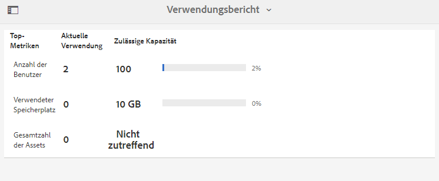

## Änderungen in Version 2020.10.0 {#what-changed-in-oct-2020}

Brand Portal 2020.10.0 liefert Verbesserungen, die hauptsächlich das Download-Erlebnis vereinfachen, außerdem liefert die Version wichtige Fehlerbehebungen. Zu den Verbesserungen gehören ein neuer und verbesserter Workflow für den Asset-Download, zusätzliche Optionen zum Ausschließen von Ausgabedarstellungen, direkter Download aus dem Bedienfeld **[!UICONTROL Ausgabedarstellungen]**, Konfiguration für Zugriffs- und Download-Rechte für bestimmte Benutzergruppen sowie einfache Navigation zu Dateien, Sammlungen und freigegebenen Links von allen Brand Portal-Seiten aus. Weitere Informationen finden Sie in den aktuellen [Brand Portal-Versionshinweisen](brand-portal-release-notes.md).

### Vereinfachtes Download-Erlebnis {#download-dialog}

Zuvor wurde das Dialogfeld **[!UICONTROL Herunterladen]** mit mehreren Optionen angezeigt, unter anderem zum Erstellen separater Ordner für jedes Asset, zum Versenden von Assets per E-Mail, zum Auswählen des Original-Assets, für benutzerdefinierte und dynamische Ausgabedarstellungen, zum Ausschließen von System-Ausgabedarstellungen und zum Aktivieren der Download-Beschleunigung. Diese Optionen waren für technisch nicht versierte und neue Benutzer mehrdeutig, insbesondere wenn mehrere Assets oder Ordner für den Download ausgewählt wurden. Außerdem konnte der Benutzer nicht alle Asset-Ausgabedarstellungen sehen oder eine bestimmte benutzerdefinierte oder dynamische Ausgabedarstellung ausschließen.

Das neue Dialogfeld **[!UICONTROL Herunterladen]** verallgemeinert die Auswahl und das Filtern von Assets, wodurch Brand Portal-Benutzer beim Download von Asset-Ausgabedarstellungen leichter die richtigen Entscheidungen treffen können. Im Dialogfeld werden alle ausgewählten Assets und deren Ausgabedarstellungen abhänig von der [**[!UICONTROL Download]**](brand-portal-download-assets.md)-Konfiguration und den **[!UICONTROL Download]** -Einstellungen aufgeführt.

>[!NOTE]
>
>Für alle Benutzer ist jetzt standardmäßig **[!UICONTROL Schneller Download]** aktiviert. Vor dem Herunterladen der Assets aus Brand Portal muss IBM Aspera Connect 3.9.9 (`https://www.ibm.com/docs/en/aspera-connect/3.9.9`) in der Browser-Erweiterung installiert sein.

<!--
If any of the **[!UICONTROL Custom Rendition]** or **[!UICONTROL System Rendition]** is enabled in the [**[!UICONTROL Download]**](brand-portal-download-assets.md) configuration and **[!UICONTROL Download]** settings are enabled for the group users, the new **[!UICONTROL Download]** dialog appears with all the renditions of the selected assets or folders containing assets in a list view. 
-->

Im Dialogfeld **[!UICONTROL Herunterladen]** haben Benutzer folgende Möglichkeiten:

* Anzeigen aller verfügbarer Ausgabedarstellungen eines Assets in der Download-Liste.
* Ausschließen von Ausgabedarstellungen der Assets, die nicht heruntergeladen werden müssen.
* Anwenden desselben Ausgabedarstellungssatzes auf alle ähnlichen Asset-Typen mit einem Klick.
* Anwenden unterschiedlicher Ausgabedarstellungssätze auf unterschiedliche Asset-Typen.
* Erstellen eines separaten Ordners für jedes Asset.
* Herunterladen ausgewählter Assets und ihrer Ausgabedarstellungen.

Der Download-Workflow bleibt für eigenständige Assets, mehrere Assets, Ordner mit Assets, lizenzierte oder nicht lizenzierte Assets und den Download von Assets über einen Freigabe-Link konstant. Siehe [Schritte zum Herunterladen von Assets aus Brand Portal](https://experienceleague.adobe.com/docs/experience-manager-brand-portal/using/download/brand-portal-download-assets.html).

### Schnellnavigation  {#quick-navigation}

Zuvor war die Option zur Anzeige von **[!UICONTROL Dateien]**, **[!UICONTROL Sammlungen]** und **[!UICONTROL freigegebenen Links]** verborgen und erforderte jedes Mal mehrere Klicks, wenn der Benutzer zu einer anderen Ansicht wechseln wollte.

In Brand Portal 2020.10.0 können Benutzer von allen Brand Portal-Seiten mithilfe der Links für die Schnellnavigation mit nur einem Klick zu **[!UICONTROL Dateien]**, **[!UICONTROL Sammlungen]** und **[!UICONTROL geteilten Links]** navigieren.

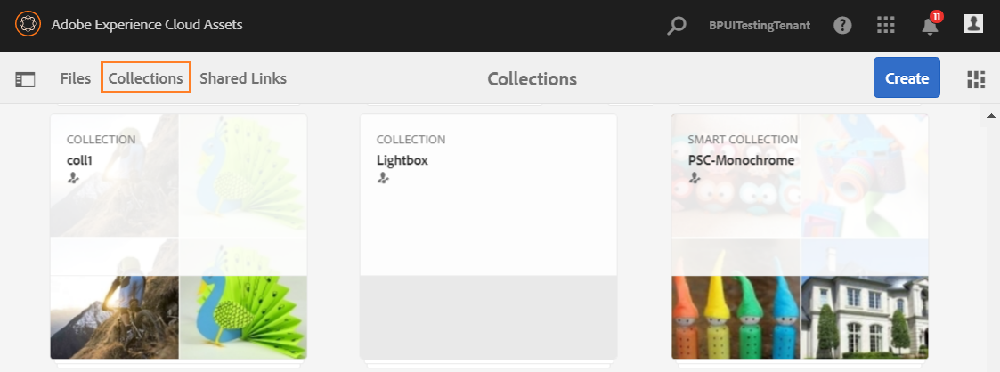

### Verbessertes Dialogfeld „Ausgabedarstellungen“ {#rendition-panel}

Zuvor konnten Benutzer das Original-Asset uns eine Ausgabedarstellungen nur dann im Dialogfeld **[!UICONTROL Ausgabedarstellungen]** anzeigen, wenn die Option **[!UICONTROL Benutzerdefinierte Ausgabedarstellung]** bzw. **[!UICONTROL System-Ausgabedarstellung]** in der **[!UICONTROL Download]**-Konfiguration aktiviert war. Außerdem mussten Benutzer alle Asset-Ausgabedarstellungen herunterladen, da kein Filter zum Ausschließen bestimmter benutzerdefinierter oder dynamischer Ausgabedarstellungen vorhanden war.

<!--
Earlier, if any of the custom or system renditions was enabled in the **[!UICONTROL Download]** settings, an additional **[!UICONTROL Download]** dialog appeared on clicking the **[!UICONTROL Download]** button wherein the user had to manually select the set of renditions (original asset, custom renditions, dynamic renditions) to download.
There was no filter to exclude specific custom or dynamic renditions which were not required for download.
-->

In Brand Portal 2020.10.0 können Benutzer bestimmte Ausgabedarstellungen ausschließen und die ausgewählten Ausgabedarstellungen direkt [aus dem Bedienfeld Ausgabedarstellungen](brand-portal-download-assets.md#download-assets-from-asset-details-page) auf der Asset-Detailseite herunterladen, ohne dass sie dafür das Dialogfeld **[!UICONTROL Herunterladen]** öffnen müssen.

<!-- 
In Brand Portal 2020.10.0, direct download and exclude renditions features are introduced in the **[!UICONTROL Renditions]** panel on the asset details page. All the renditions (original asset, custom renditions, dynamic renditions) under the rendition panel are now associated with a check box and are enabled by default. 

The user can clear the check boxes to exclude the renditions which are not required for download. And can click on the **[!UICONTROL Download]** button in the **[!UICONTROL Renditions]** panel to directly download the selected set of renditions in a zip folder without having to open the **[!UICONTROL Download]** dialog.
-->

### Download-Einstellungen konfigurieren {#download-permissions}

Zusätzlich zu den vorhandenen **[!UICONTROL Download]**-Konfigurationen können Brand Portal-Administratoren auch Einstellungen für verschiedene Benutzergruppen für die Anzeige und/oder den Download des Original-Assets und seiner Ausgabedarstellungen von der Asset-Detailseite konfigurieren.

Melden Sie sich bei Ihrem Brand Portal-Mandanten als Administrator an und navigieren Sie zu **[!UICONTROL Tools]** > **[!UICONTROL Benutzer]**.

Navigieren Sie auf der Seite **[!UICONTROL Benutzerrollen]** zur Registerkarte **[!UICONTROL Gruppen]**, um die Ansicht und (oder) die Download-Einstellungen für die Benutzergruppen zu konfigurieren.

Früher konnte mit den Einstellungen lediglich eingeschränkt werden, welche Benutzergruppen das Original-Asset herunterladen konnten.

Auf der Registerkarte **[!UICONTROL Gruppen]** auf der Seite **[!UICONTROL Benutzerrollen]** können Administratoren die Anzeige- und Download-Einstellungen konfigurieren:

* Wenn die Optionen **[!UICONTROL Original herunterladen]** und **[!UICONTROL Ausgabedarstellungen herunterladen]** aktiviert sind, können Benutzer der ausgewählten Gruppe die Original-Assets anzeigen und herunterladen.
* Wenn beide Einstellungen deaktiviert sind, können Benutzer nur die Original-Assets anzeigen. Die Asset-Ausgabedarstellungen sind auf der Asset-Detailseite für Benutzer nicht sichtbar.
* Wenn nur die Einstellung **[!UICONTROL Original herunterladen]** aktiviert ist, können Benutzer nur die Original-Assets auf der Asset-Detailseite anzeigen und von dort herunterladen.
* Wenn nur die Einstellung **[!UICONTROL Ausgabedarstellungen herunterladen]** aktiviert ist, können Benutzer das Original-Asset anzeigen, aber nicht herunterladen. Benutzer können jedoch die Asset-Ausgabedarstellungen anzeigen und herunterladen.

Siehe [Konfigurieren des Asset-Downloads](https://experienceleague.adobe.com/docs/experience-manager-brand-portal/using/download/brand-portal-download-assets.html#configure-download-permissions).

>[!NOTE]
>
>Wenn ein Benutzer mehreren Gruppen hinzugefügt wurde und eine dieser Gruppen über Einschränkungen verfügt, gelten die Einschränkungen für diesen Benutzer.

<!--
>Restrictions to access the original asset and their renditions do not apply to administrators even if they are members of restricted groups.
 >
 >The users can always download assets and their renditions from the repository using a `curl` request even if the download configurations are turned-off.
 >
-->

## Änderungen in Version 6.4.7 {#what-changed-in-647}

Brand Portal 6.4.7 führt den Dokument-Viewer ein, verbessert die Leistung beim Herunterladen von Assets und enthält wichtige Fehlerbehebungen. Weitere Informationen finden Sie in den aktuellen [Brand Portal-Versionshinweisen](brand-portal-release-notes.md).

<!--
Brand Portal 6.4.7 release brings in the Document Viewer, leverages the Brand Portal administrators to configure asset download, and centers top customer requests. See latest [Brand Portal Release Notes](brand-portal-release-notes.md).
-->

### Dokument-Viewer {#doc-viewer}

Der Dokument-Viewer verbessert das PDF-Anwendererlebnis. Er bietet beim Anzeigen von PDF-Dateien in Brand Portal ein ähnliches Erlebnis wie Adobe Document Cloud.

Zuvor standen begrenzte Optionen zum Anzeigen der PDF-Dateien zur Verfügung.

Mit Dokument-Viewer haben die Brand Portal-Benutzer jetzt die Möglichkeit, Seiten anzuzeigen, Lesezeichen anzuzeigen, Text auf der Seite zu suchen, zu vergrößern, zu verkleinern, zur vorherigen und nächsten Seite zu navigieren, zu einer Seite zu wechseln, an das Fenster anzupassen, an den Bildschirm anzupassen. und die Symbolleiste ein- oder ausblenden.

>[!NOTE]
>
>Das Anzeigeerlebnis für andere Dokumentenformate bleibt unverändert.

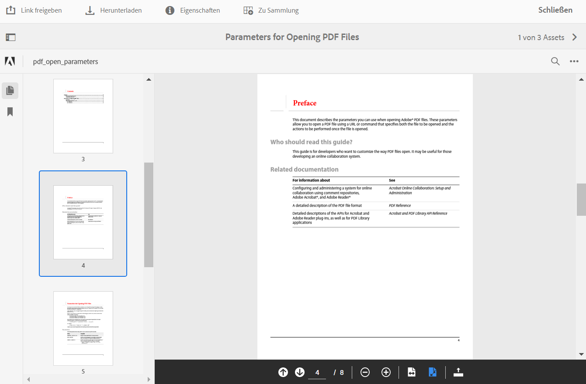

### Download-Erlebnis {#download-configurations}

Der Asset-Download-Prozess wurde überarbeitet und bietet ein vereinfachtes Anwendererlebnis beim [Herunterladen von Assets aus Brand Portal](brand-portal-download-assets.md).

Dem bestehenden Workflow zum Herunterladen von Assets aus Brand Portal folgt zwangsläufig das Erscheinen eines **[!UICONTROL Download]**-Dialogfelds mit mehreren Download-Optionen zur Auswahl.

In Brand Portal 6.4.7 können die Brand Portal-Administratoren die Einstellungen für den Asset-**[!UICONTROL Download]** konfigurieren. Die folgenden Konfigurationen sind verfügbar:

* **[!UICONTROL Schneller Download]**
* **[!UICONTROL Benutzerdefinierte Ausgabedarstellungen]**
* **[!UICONTROL Systemausgabedarstellungen]**

Der Brand Portal-Administrator kann eine beliebige Kombination aktivieren, um den Asset-Download zu konfigurieren.

<!--In Brand Portal 6.4.7, fast download, custom renditions, and system renditions are the three configurations available.-->

* Wenn sowohl die Konfigurationen für **[!UICONTROL benutzerdefinierte Ausgaben]** als auch für **[!UICONTROL Systemausgaben]** deaktiviert sind, werden die ursprünglichen Ausgaben der Assets ohne ein zusätzliches Dialogfeld heruntergeladen, wodurch der Download für die Benutzer von Brand Portal vereinfacht wird.

* Wenn die **[!UICONTROL benutzerdefinierte Ausgabe]** oder die **[!UICONTROL Systemausgabe]** aktiviert ist, wird das Dialogfeld **[!UICONTROL Herunterladen]** angezeigt und das ursprüngliche Asset zusammen mit den Asset-Ausgaben heruntergeladen. Durch die Aktivierung der Konfiguration **[!UICONTROL Schneller Download]** wird der Download-Prozess beschleunigt.

Je nach Konfiguration bleibt der Download-Workflow für eigenständige Assets, mehrere Assets, Ordner mit Assets, lizenzierte oder nicht lizenzierte Assets und den Download von Assets über einen Freigabe-Link konstant.

## Änderungen in Version 6.4.6 {#what-changed-in-646}

In Brand Portal 6.4.6 wurde der Autorisierungskanal zwischen AEM Assets und Brand Portal geändert. Brand Portal wird jetzt von AEM Assets as a Cloud Service, AEM Assets 6.3 und höher unterstützt. In AEM Assets 6.3 und höher wurde Brand Portal zuvor in der klassischen Benutzeroberfläche über das alte OAuth-Gateway konfiguriert. Das Gateway ruft mithilfe des JWT-Token-Austauschs ein IMS-Zugriffs-Token zur Autorisierung ab. AEM Assets wird jetzt mit Brand Portal über die Adobe-Entwicklerkonsole konfiguriert, die ein IMS-Token zur Authentifizierung Ihres Brand Portal-Mandanten abruft.

<!-- The steps to configure integration are different depending on your AEM version, and whether you are configuring for the first-time, or upgrading the existing integration:
-->

<!--
  
   | **AEM Version** |**New Integration** |**Upgrade Integration** |
|---|---|---|
| **AEM 6.5** |[Create new integration](../using/brand-portal-configure-integration-65.md) |[Upgrade existing integration](../using/brand-portal-configure-integration-65.md#upgrade-integration-65) | 
| **AEM 6.4** |[Create new integration](../using/brand-portal-configure-integration-64.md) |[Upgrade existing integration](../using/brand-portal-configure-integration-64.md#upgrade-integration-64) | 
| **AEM 6.3** |[Create new integration](../using/brand-portal-configure-integration-63.md) |[Upgrade existing integration](../using/brand-portal-configure-integration-63.md#upgrade-integration-63) | 
| **AEM 6.2** | | 

   -->

Die Schritte zum Konfigurieren von AEM Assets mit Brand Portal unterscheiden sich je nach Ihrer AEM-Version und abhängig davon, ob Sie zum ersten Mal eine Konfiguration durchführen oder die vorhandenen Konfigurationen aktualisieren:

<!--| **AEM Version** |**New Configuration** |**Upgrade Configuration** |
|---|---|---|
| **AEM 6.5 (6.5.4.0 and above)** |[Create configuration](../using/brand-portal-configure-integration-65.md) |[Upgrade configuration](../using/brand-portal-configure-integration-65.md#upgrade-integration-65) | 
| **AEM 6.4 (6.4.8.0 and above)** |[Create configuration](../using/brand-portal-configure-integration-64.md) |[Upgrade configuration](../using/brand-portal-configure-integration-64.md#upgrade-integration-64) | 
| **AEM 6.3 (6.3.3.8 and above)** |[Create configuration](../using/brand-portal-configure-integration-63.md) |[Upgrade configuration](../using/brand-portal-configure-integration-63.md#upgrade-integration-63) | 

-->

<!-- AEM Assets configuration with Brand Portal on Adobe I/O is supported on:
* AEM 6.5.4.0 and above
* AEM 6.4.8.0 and above
* AEM 6.3.3.8 and above -->

| **AEM-Version** | **Neue Konfiguration** | **Upgrade der Konfiguration** |
|---|---|---|
| **AEM Assets as a Cloud Service** | [Konfiguration erstellen](https://experienceleague.adobe.com/docs/experience-manager-cloud-service/assets/brand-portal/configure-aem-assets-with-brand-portal.html) | - |
| **AEM 6.5 (6.5.4.0 und höher)** | [Konfiguration erstellen](https://experienceleague.adobe.com/docs/experience-manager-65/assets/brandportal/configure-aem-assets-with-brand-portal.html?lang=de) | [Upgrade der Konfiguration](https://experienceleague.adobe.com/docs/experience-manager-65/assets/brandportal/configure-aem-assets-with-brand-portal.html?lang=de#upgrade-integration-65) |
| **AEM 6.4 (6.4.8.0 und höher)** | [Konfiguration erstellen](https://experienceleague.adobe.com/docs/experience-manager-64/assets/brandportal/configure-aem-assets-with-brand-portal.html?lang=de) | [Upgrade der Konfiguration](https://experienceleague.adobe.com/docs/experience-manager-64/assets/brandportal/configure-aem-assets-with-brand-portal.html?lang=de#upgrade-integration-64) |
| **AEM 6.3 (6.3.3.8 und höher)** | [Konfiguration erstellen](https://helpx.adobe.com/de/experience-manager/6-3/assets/using/brand-portal-configuring-integration.html) | [Upgrade der Konfiguration](https://helpx.adobe.com/de/experience-manager/6-3/assets/using/brand-portal-configuring-integration.html#Upgradeconfiguration) |
| **AEM 6.2** | Wenden Sie sich an den Adobe-Support | Wenden Sie sich an den Adobe-Support |

>[!NOTE]
>
>Es wird empfohlen, Ihre AEM-Instanz auf das neueste Service Pack zu aktualisieren.

Weitere Informationen finden Sie in den aktuellen [Brand Portal-Versionshinweisen](brand-portal-release-notes.md).

Siehe [Häufig gestellte Fragen zu Brand Portal](brand-portal-faqs.md).

## Änderungen in Version 6.4.5 {#what-changed-in-645}

Brand Portal 6.4.5 ermöglicht es Brand Portal-Benutzern (externe Agenturen/Teams), Inhalte in Brand Portal hochzuladen und in AEM Assets zu veröffentlichen, ohne dass sie auf die Autorenumgebung zugreifen müssen. Diese Funktion wird als **[Asset-Beschaffung in Brand Portal](brand-portal-asset-sourcing.md)** bezeichnet und verbessert das Kundenerlebnis, indem eine bidirektionale Methode zur Verfügung gestellt wird, mit der Benutzer Assets beisteuern und für andere global verteilte Brand Portal-Benutzer freigeben können.

### Asset-Beschaffung in Brand Portal {#asset-sourcing-in-bp}

Mit der Asset-Beschaffung können AEM-Benutzer (Administratoren/Benutzer ohne Administratorrechte) neue Ordner mit der zusätzlichen Eigenschaft **Asset-Beitrag** erstellen, um sicherzustellen, dass die neu erstellten Ordner von Brand Portal-Benutzern für die Übermittlung von Assets nutzbar sind. Dadurch wird automatisch ein Workflow ausgelöst, mit dem zwei weitere Unterordner namens „NEU“ und „FREIGEGEBEN“ im neu erstellten Ordner **Beiträge** erstellt werden.

Der AEM-Benutzer definiert dann die Anforderung, indem er eine Zusammenfassung der Asset-Typen, die dem Ordner „Beiträge“ hinzugefügt werden sollen, sowie eine Reihe von Basis-Assets in den Ordner **FREIGEGEBEN** hochlädt, um sicherzustellen, dass Brand Portal-Benutzer über die benötigten Referenzinformationen verfügen. Der Administrator kann aktiven Brand Portal-Benutzern anschließend Zugriff auf den Beitragsordner gewähren, bevor der neu erstellte **Beitragsordner** in Brand Portal veröffentlicht wird.

Nachdem die Benutzer Inhalte zum Ordner **NEU** hinzugefügt haben, können sie den Beitragsordner wieder in der AEM-Autorenumgebung veröffentlichen. Bitte beachten Sie, dass es einige Minuten dauern kann, bis der Import abgeschlossen ist und die neu veröffentlichten Inhalte in AEM Assets angezeigt werden.

Darüber hinaus bleiben alle vorhandenen Funktionen unverändert. Brand Portal-Benutzer können Assets aus dem Beitragsordner sowie aus anderen Ordnern anzeigen, suchen und herunterladen, für die sie über entsprechende Berechtigungen verfügen. Administratoren können außerdem den Beitragsordner freigeben, Eigenschaften ändern und Assets zu Sammlungen hinzufügen.

>[!NOTE]
>
>Die Asset-Beschaffung in Brand Portal wird ab AEM 6.5.2.0 unterstützt.
>
>Die Funktion wird in früheren Versionen – AEM 6.3 und AEM 6.4 – nicht unterstützt.

### Hochladen von Assets in den Beitragsordner {#upload-assets-in-bp}

Brand Portal-Benutzer mit entsprechenden Berechtigungen können die Asset-Anforderungen herunterladen, um die Notwendigkeit von Beiträgen zu verstehen, und mehrere Assets oder Ordner, die mehrere Assets enthalten, in den Beitragsordner hochzuladen. Beachten Sie jedoch, dass Brand Portal-Benutzer Assets nur in den Unterordner **NEU** hochladen können. Der Ordner **FREIGEGEBEN** dient zur Verteilung von Anforderungen und Grundlinien-Assets.

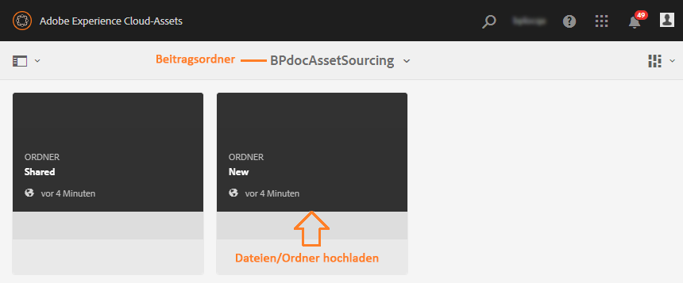

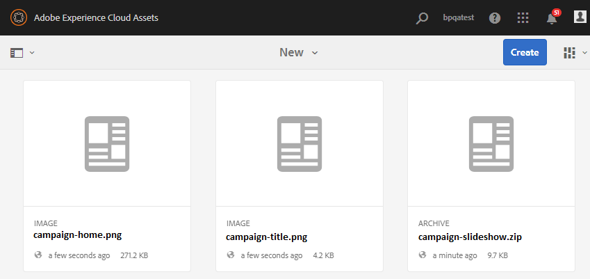

### Veröffentlichen von Beitragsordnern in AEM Assets {#publish-assets-to-aem}

Nachdem der Upload in den Ordner **NEU** abgeschlossen ist, können Brand Portal-Benutzer den Beitragsordner erneut in AEM veröffentlichen. Beachten Sie, dass es einige Minuten dauern kann, bis der Import abgeschlossen ist und die neu veröffentlichten Inhalte/Assets in AEM Assets angezeigt werden. Siehe [Veröffentlichen von Beitragsordnern in AEM Assets](brand-portal-publish-contribution-folder-to-aem-assets.md).

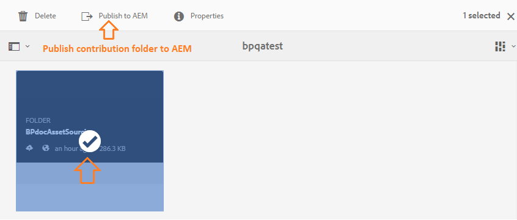

## Änderungen in Version 6.4.4 {#what-changed-in-644}

Version 6.4.4 von Brand Portal konzentriert sich auf Verbesserungen der Textsuche und von Kunden häufig gewünschte Funktionen. Weitere Informationen finden Sie in den aktuellen [Brand Portal-Versionshinweisen](brand-portal-release-notes.md).

### Verbesserungen der Suche

Ab Version 6.4.4 unterstützt Brand Portal die Suche nach Textteilen über das Eigenschaftsprädikat im Filterbereich. Um die Suche nach Textteilen zu erlauben, müssen Sie die **Teilsuche** im Eigenschaftsprädikat im Suchformular aktivieren.

Lesen Sie weiter, um mehr über die Suche nach Textteilen und Suche mit Platzhalter zu erfahren.

#### Suche nach Satzteilen {#partial-phrase-search}

Sie können nach Assets suchen, indem Sie nur einen Teil – d. h. ein oder zwei Wörter – des gesuchten Satzes in den Filterbereich eingeben.

**Anwendungsfall**
Die Suche nach Satzteilen ist hilfreich, wenn Sie sich nicht sicher sind, wie die genaue Wortfolge im gesuchten Satz lautet.

Beispiel: Wenn Ihr Suchformular in Brand Portal das Eigenschaftsprädikat für Teilsuche nach einem Asset-Titel anwendet, werden nach Angabe des Begriffs **Lager** alle Assets mit dem Wort Lager im Titelsatz zurückgegeben.

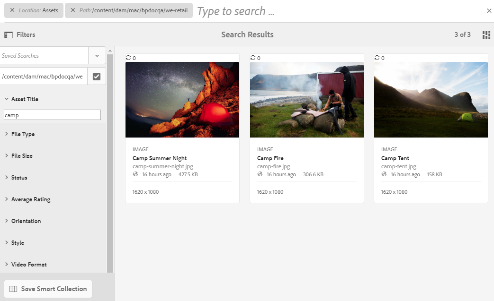

#### Suche mit Platzhalter {#wildcard-search}

In Brand Portal können Sie das Sternchen (*) in der Suchanfrage zusammen mit einem Teil des Wortes in der gesuchten Phrase verwenden.

**Nutzungsszenario. Wenn Sie sich nicht sicher sind, welche Wörter im gesuchten Satz enthalten sind, können Sie eine Suche mit Platzhalter verwenden, um die Lücken in der Suchabfrage zu füllen.

Beispielsweise werden durch die Angabe von **klettern*** alle Assets zurückgegeben, deren Titelphrase Wörter enthält, die mit den Zeichen **klettern** beginnen, wenn das Suchformular in Brand Portal das Eigenschaftsprädikat für Teilsuche auf Asset-Titel anwendet.

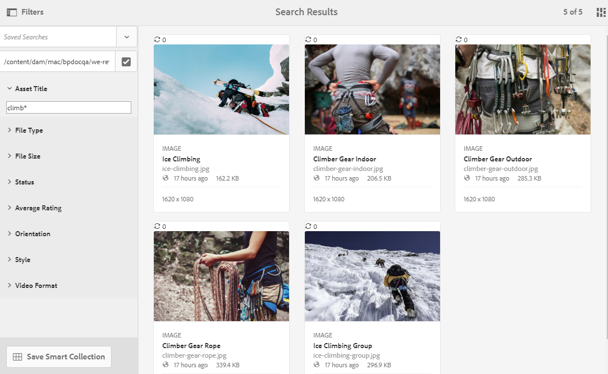

Auch gilt Folgendes:

* Durch die Angabe von **\*klettern** werden alle Assets zurückgegeben, deren Titelphrase Wörter enthält, die mit den Zeichen **klettern** enden.

* Durch die Angabe von **\*klettern\*** werden alle Assets zurückgegeben, deren Titelphrase Wörter enthält, die die Zeichen **klettern** enthalten.

>[!NOTE]
>
>Nach Aktivierung des Kontrollkästchens **Teilsuche** wird **Groß-/Kleinschreibung ignorieren** standardmäßig aktiviert.

## Änderungen in Version 6.4.3 {#what-changed-in}

Version 6.4.3 von Brand Portal bietet Unternehmen neben der Mandanten-ID einen alternativen Alias für die Brand Portal-Zugriffs-URL, eine neue Ordnerhierarchie-Konfiguration, Verbesserungen bei der Videounterstützung, die geplante Veröffentlichung aus der AEM-Autoreninstanz in Brand Portal, funktionale Verbesserungen und die Umsetzung von Kundenwünschen.

### Ordnerhierarchienavigation für Benutzer ohne Administratorrechte

Administratoren können jetzt konfigurieren, wie Ordner für Benutzer ohne Administratorrechte (Bearbeiter, Betrachter und Gastbenutzer) bei der Anmeldung angezeigt werden. Die Konfiguration [Ordnerhierarchie aktivieren](../using/brand-portal-general-configuration.md) wird in den **Allgemeinen Einstellungen** im Admin-Tools-Bereich hinzugefügt. Wenn die Konfiguration:

* **aktiviert** ist, ist die Ordnerstruktur ab dem Stammordner für Nicht-Administratoren sichtbar. Sie können also genauso wie Administratoren navigieren.
* **deaktiviert** ist, werden auf der Einstiegsseite nur die freigegebenen Ordner angezeigt.

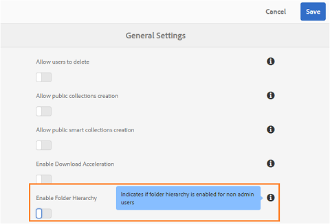

Wenn die Funktion [Ordnerhierarchie aktivieren](../using/brand-portal-general-configuration.md) aktiviert ist, können Sie besser zwischen verschiedenen Ordnern mit demselben Namen unterscheiden, die über verschiedene Hierarchien freigegeben werden. Bei der Anmeldung sehen Nicht-Administratoren nun die virtuellen übergeordneten (und untergeordneten) Ordner der freigegebenen Ordner.

Die freigegebenen Ordner werden innerhalb der jeweiligen Verzeichnisse in virtuellen Ordnern angeordnet. Sie können diese virtuellen Ordner an einem Schlosssymbol erkennen.

Das Standardminiaturbild der virtuellen Ordner ist das Miniaturbild des ersten freigegebenen Ordners.

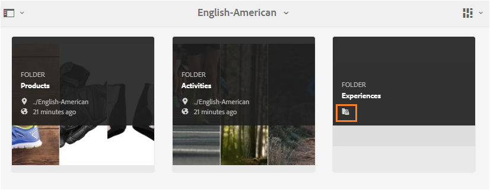

### Suche in einer bestimmten Ordnerhierarchie oder in einem bestimmten Ordnerpfad

Die Eigenschaft **Pfad-Browser** wird in das Suchformular eingeführt, um das Suchen von Assets in einem bestimmten Verzeichnis zu ermöglichen. Der Standardsuchpfad der Sucheigenschaft für den Pfad-Browser lautet `/content/dam/mac/<tenant-id>/`. Dieser kann durch Bearbeiten des Standardsuchformulars konfiguriert werden.

* Administratoren können über den Pfad-Browser zu einem beliebigen Verzeichnis in Brand Portal navigieren.
* Nicht-Administratoren können über den Pfad-Browser nur zu den Ordnern navigieren, die für sie freigegeben sind, und wieder zurück zu den übergeordneten Ordnern.

   Zum Beispiel wird `/content/dam/mac/<tenant-id>/folderA/folderB/folderC` für einen Nicht-Administrator freigegeben. Der Benutzer kann mithilfe des Pfad-Browsers innerhalb von OrdnerC nach Assets suchen. Dieser Benutzer kann auch zu OrdnerB und OrdnerA navigieren (da es sich um übergeordnete Elemente des Ordners handelt, der für den Benutzer freigegeben ist).

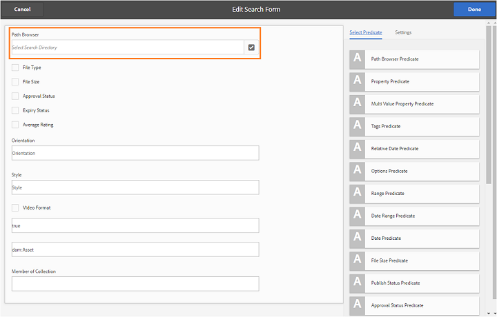

Sie können die Asset-Suche nun in einem bestimmten Ordner einschränken, zu dem Sie navigiert sind, anstatt die Einschränkung angefangen beim Stammordner anzuwenden.

Beachten Sie, dass die Suche in diesen Ordnern nur Suchergebnisse aus Assets zurückgibt, die für den Benutzer freigegeben wurden.

### Unterstützung von Dynamic Media Video-Ausgabedarstellungen

Benutzer, deren AEM-Autoreninstanz sich im Dynamic Media-Hybridmodus befindet, können – zusätzlich zu den Originalvideodateien – Dynamic Media-Ausgabedastellungen in der Vorschau ansehen und herunterladen.

Um Dynamic Media-Ausgabedarstellungen als Vorschau für bestimmte Mandantenkonten anzeigen (oder herunterladen) zu können, müssen Administratoren die **Dynamic Media-Konfiguration** (Video-Service-URL (DM-Gateway-URL) und Registrierungs-ID zum Abrufen des dynamischen Videos) in der Konfiguration **Video** im Admin-Tools-Bereich angeben.

Vorschau der Dynamic Media-Videos ist möglich auf/in:

* Asset-Detailseite
* Asset-Kartenansicht
* Linkfreigabe-Vorschauseite

Dynamic Media-Videokodierungen können heruntergeladen werden über:

* Brand Portal
* Freigegebenen Link

### Geplante Veröffentlichung in Brand Portal

Der Veröffentlichungs-Workflow für Assets (und Ordner) aus der [AEM (6.4.2.0)](https://experienceleague.adobe.com/docs/experience-manager-64/release-notes/sp-release-notes.html?lang=de)-Autoreninstanz in Brand Portal kann für einen späteren Zeitpunkt (Datum, Uhrzeit) geplant werden.

Entsprechend können veröffentlichte Assets zu einem späteren Zeitpunkt aus dem Portal entfernt werden, indem der Workflow zum Rückgängigmachen der Veröffentlichung in Brand Portal geplant wird.

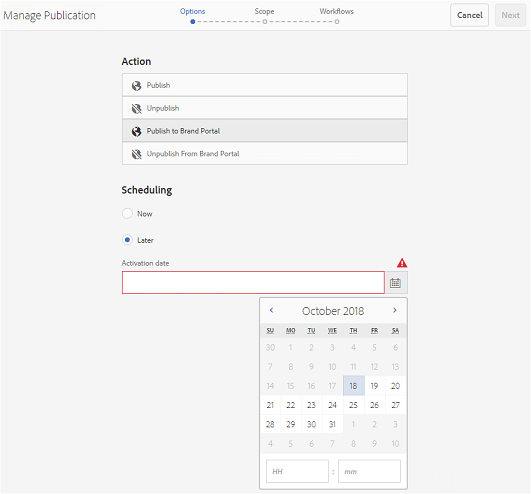

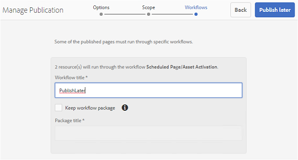

### Konfigurierbarer Mandantenalias in URL

Unternehmen können ihre Portal-URL mit einem alternativen Präfix in der URL anpassen. Um einen Alias für einen Mandantenamen in der vorhandenen Portal-URL zu erhalten, müssen Unternehmen sich mit dem Adobe-Support in Verbindung setzen.

Beachten Sie, dass nur das Präfix der Brand Portal-URL angepasst werden kann und nicht die gesamte URL.\
Für eine Organisation mit der vorhandenen Domain **geomettrix.brand-portal.adobe.com** kann beispielsweise auf Anfrage die Domain **geomettrixinc.brand-portal.adobe.com** erstellt werden.

Eine AEM-Autoreninstanz kann jedoch nur mit der Mandanten-ID-URL [konfiguriert](https://experienceleague.adobe.com/docs/experience-manager-65/assets/brandportal/configure-aem-assets-with-brand-portal.html) werden und nicht mit einer (alternativen) Mandantenalias-URL.

Unternehmen können ihre Branding-Anforderungen erfüllen, indem sie ihre Portal-URL anpassen, anstatt die von Adobe bereitgestellte URL beizubehalten.

### Optimierter Download

In der Version wurde der Download vereinfacht, sodass in den folgenden Situationen weniger Klicks notwendig sind und weniger Warnungen angezeigt werden:

* Entscheidung, dass nur die Ausgabedarstellungen heruntergeladen werden (und nicht die Original-Assets).
* Herunterladen der Assets, wenn der Zugriff auf die Original-Ausgabedarstellungen eingeschränkt ist.

## Änderungen in Version 6.4.2 {#what-changed-in-1}

Die Brand Portal-Version 6.4.2 umfasst eine Reihe von Funktionen, die die Bedürfnisse von Organisationen hinsichtlich der Asset-Verteilung erfüllen. Durch Bereitstellung eines Gastzugangs und optimale Download-Zeiten dank beschleunigter Downloads können Organisationen eine große Anzahl an weltweit verteilten Benutzern erreichen. Darüber hinaus bietet Brand Portal Organisationen durch neue Konfigurationsoptionen für Administratoren, einen neu hinzugefügten Bericht und bessere Berücksichtigung von Kundenanforderungen eine größere Kontrolle.

### Gastzugang

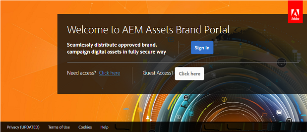

AEM Brand Portal gestattet den Gastzugang für das Portal. Ein Gastbenutzer benötigt keine Anmeldeinformationen, um das Portal aufzurufen, und kann auf sämtliche öffentliche Ordner und Sammlungen zugreifen und diese herunterladen. Gastbenutzer können Assets zu ihrer Lightbox (private Sammlung) hinzufügen und diese herunterladen. Sie können Smart-Tag-basierte Suchen und Sucheigenschaften, die von Administratoren festgelegt wurden, anzeigen. Die Gastsitzung gestattet es Benutzern jedoch nicht, Sammlungen und gespeicherte Suchen zu erstellen oder weiter freizugeben, auf die Einstellungen für Ordner und Sammlungen zuzugreifen und Assets als Links freizugeben.

In einer Organisation sind mehrere gleichzeitige Gastsitzungen zulässig, deren Zahl ist jedoch auf 10 % des Gesamtbenutzerkontingents pro Organisation beschränkt.

Eine Gastsitzung bleibt für zwei Stunden aktiv. Infolgedessen wird der Status der Lightbox auch bis zwei Stunden nach Beginn der Sitzung beibehalten. Nach zwei Stunden muss die Gastsitzung neu gestartet werden, d. h. der Lightbox-Status geht verloren.

### Beschleunigte Downloads

Brand Portal-Benutzer können mit der IBM Aspera Connect-basierten Download-Beschleunigung – unabhängig von ihrem globalen Standort – bis zu 25-mal höhere Geschwindigkeiten und eine unterbrechungsfreie Download-Performance erzielen. Um Assets schneller aus Brand Portal oder über den freigegebenen Link herunterzuladen, müssen Benutzer die Option **Downloadbeschleunigung aktivieren** im Dialogfeld „Herunterladen“ auswählen, sofern die Downloadbeschleunigung im Unternehmen aktiviert ist.

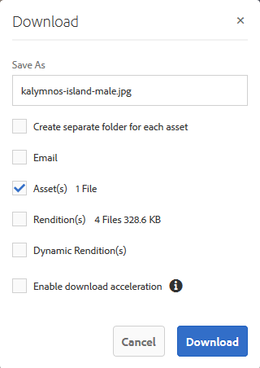

Um die IBM Aspera Connect-basierte Download-Beschleunigung für Benutzer der Organisation zu aktivieren, müssen Administratoren die Option **Download-Beschleunigung aktivieren** (die standardmäßig deaktiviert ist) unter [Allgemeine Einstellungen](brand-portal-general-configuration.md#allow-download-acceleration) im Admin-Tools-Bereich auswählen. Weitere Informationen zu den Voraussetzungen und den Schritten zur Fehlerbehebung bei Problemen mit dem schnelleren Download von Asset-Dateien von Brand Portal und über freigegebene Links finden Sie unter [Anleitung zum Beschleunigen von Downloads von Brand Portal](../using/accelerated-download.md#main-pars-header).

### Bericht „Benutzeranmeldungen“

Es wurde ein neuer Bericht zum Nachverfolgen von Benutzeranmeldungen eingeführt. Der Bericht **Benutzeranmeldungen** bietet Organisationen die Möglichkeit, die delegierten Administratoren und andere Benutzer von Brand Portal zu überwachen und zu kontrollieren.

Der Bericht enthält den Anzeigenamen, die E-Mail-IDs, die Rollen (Admin, Betrachter, Bearbeiter, Gast), die Gruppen, Angaben zur letzten Anmeldung, den Aktivitätsstatus und die Anzahl der Anmeldungen von jedem Benutzer seit der Bereitstellung von Brand Portal 6.4.2 bis zum Zeitpunkt der Berichterstellung. Administratoren können den Bericht als .csv-Datei exportieren. Der Bericht „Benutzeranmeldungen“ gestattet in Verbindung mit anderen Berichten eine genauere Überwachung der Benutzerinteraktionen mit den genehmigten Brand-Ressourcen und gewährleistet so die Einhaltung von Vorschriften der Corporate Compliance Offices.

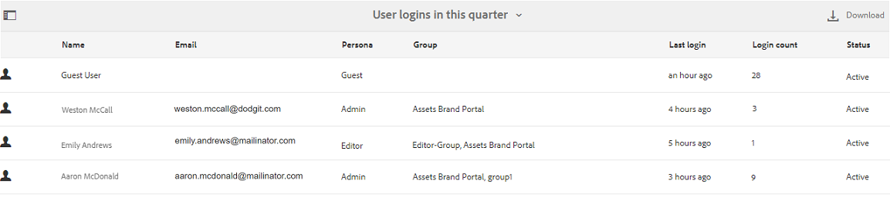

### Zugriff auf die Original-Ausgabedarstellungen

Administratoren können den Zugriff auf die Original-Bilddateien (.jpeg, .tiff, .png, .bmp, .gif, .pjpeg, x-portable-anymap, x-portable-bitmap, x-portable-graymap, x-portable-pixmap, x-rgb, x-xbitmap, x-xpixmap, x-icon, image/photoshop, image/x-photoshop, .psd, image/vnd.adobe.photoshop) einschränken und Zugriff auf Ausgabedarstellungen mit einer niedrigen Auflösung erteilen, die aus Brand Portal oder über einen freigegebenen Link heruntergeladen werden. Dieser Zugriff kann auf Benutzergruppenebene über die Registerkarte „Gruppen“ auf der Seite „Benutzerrollen“ im Admin-Tools-Bereich gesteuert werden.

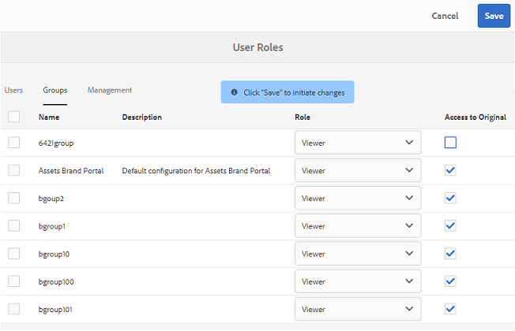

* Standardmäßig sind alle Benutzer berechtigt, Original-Ausgabedarstellungen herunterzuladen, da die Option „Zugriff auf Original“ für alle aktiviert ist.
* Administratoren müssen die Auswahl der entsprechenden Kontrollkästchen deaktivieren, um zu verhindern, dass eine Gruppe von Benutzern auf Original-Ausgabedarstellungen zugreift.
* Falls ein Benutzer Mitglied mehrerer Gruppen ist, eine dieser Gruppen aber über Einschränkungen verfügt, gelten die Einschränkungen für diesen Benutzer.
* Die Einschränkungen gelten nicht für Administratoren, auch wenn sie Mitglieder von eingeschränkten Gruppen sind.
* Die Berechtigungen des Benutzers, der Assets als Link freigibt, gelten auch für die Benutzer, die die Assets über die freigegebenen Links herunterladen.

### Ordnerhierarchiepfad in Karten- und Listenansichten

Auf den Karten von Ordnern in der Kartenansicht werden für Benutzer ohne Administratorrechte (Bearbeiter, Betrachter und Gastbenutzer) jetzt Informationen zur Ordnerhierarchie angezeigt. Diese Funktion informiert die Benutzer über den Speicherort der Ordner, auf die sie zugreifen, in Bezug auf die übergeordnete Hierarchie.

Informationen zur Ordnerhierarchie sind besonders hilfreich, um die Ordner zu unterscheiden, deren Namen anderen Ordnern ähneln, die in einer anderen Ordnerhierarchie freigegeben sind. Wenn Benutzer ohne Administratorrechte nicht die Ordnerstruktur der für sie freigegebenen Assets berücksichtigen, können Assets bzw. Ordner mit denselben Namen für Verwirrung sorgen.

* Die auf den entsprechenden Karten angezeigten Pfade werden so gekürzt, dass sie zu den Kartengrößen passen. Die Benutzer können den vollständigen Pfad jedoch in einer QuickInfo sehen, wenn sie den Mauszeiger über den verkürzten Pfad bewegen.

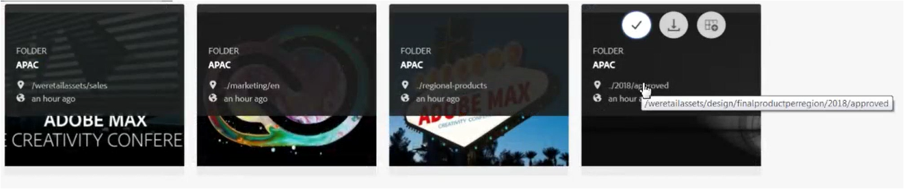

In der Listenansicht wird der Ordnerpfad der Assets in einer Spalte für alle Benutzer von Brand Portal angezeigt.

### Option „Überblick“ zur Anzeige der Asset-Eigenschaften

Brand Portal stellt Benutzern ohne Administratorrechte (Bearbeitern, Betrachtern, Gastbenutzern) mit der Option „Überblick“ eine Funktion zum Anzeigen von Asset-Eigenschaften von ausgewählten Assets/Ordnern bereit. Die Option „Überblick“ finden Sie an folgenden Stellen:

1. In der Symbolleiste am oberen Rand des ausgewählten Assets/Ordners
2. In der Dropdown-Liste des ausgewählten Leistenselektors

Bei Auswahl der Option „Überblick“ bei ausgewähltem Asset/Ordner können die Benutzer den Titel, den Pfad und den Zeitpunkt der Asset-Erstellung sehen. Wohingegen die Benutzer bei Auswahl der Option „Überblick“ auf der Asset-Detailseite die Metadaten des Assets sehen können.

## Neue Konfigurationen

Es wurden sechs neue Konfigurationen hinzugefügt, damit Administratoren folgende Funktionen für bestimmte Mandanten aktivieren bzw. deaktivieren können:

* Zulassen des Gastzugangs
* Zugriffsanfrage für Brand Portal durch Benutzer erlauben
* Löschen von Assets von Brand Portal durch Administratoren zulassen
* Erstellung öffentlicher Sammlungen zulassen
* Erstellung öffentlicher Smart-Sammlungen zulassen
* Downloadbeschleunigung aktivieren

Die zuvor genannten Konfigurationen sind unter „Zugriff“ und „Allgemeine Einstellungen“ im Admin-Tools-Bereich verfügbar.

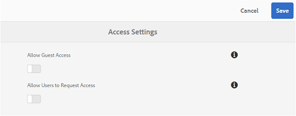
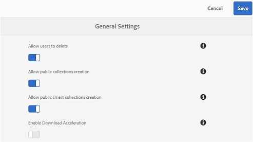

### Adobe i/O-Benutzeroberfläche zum Konfigurieren von oAuth-Integrationen

Ab Brand Portal 6.4.2 wird die alte OAuth-Schnittstelle (`https://legacy-oauth.cloud.adobe.io/`) zum Erstellen der JWT-Anwendung verwendet, über die OAuth-Integrationen so konfiguriert werden können, dass sie eine AEM Assets-Integration in Brand Portal unterstützen. Zuvor wurde die Benutzeroberfläche zum Konfigurieren von OAuth-Integrationen unter `https://marketing.adobe.com/developer/` gehostet. Weitere Informationen zur Integration von AEM Assets mit Brand Portal, um Assets und Sammlungen in Brand Portal zu veröffentlichen, finden Sie unter [Konfigurieren der Integration von AEM Assets mit Brand Portal](https://experienceleague.adobe.com/docs/experience-manager-64/assets/brandportal/configure-aem-assets-with-brand-portal.html).

## Verbesserungen der Suche

Administratoren können die Eigenschaftsprädikate so konfigurieren, dass nicht zwischen Groß- und Kleinschreibung unterschieden wird, indem sie das aktualisierte Eigenschaftsprädikat nutzen. Dieses verfügt über ein Kontrollkästchen zum Ignorieren von Groß- und Kleinschreibung. Die Option ist für Eigenschaftsprädikat und für Eigenschaftsprädikat mit mehreren Werten verfügbar.\
Eine Suche, bei der nicht zwischen Groß- und Kleinschreibung unterschieden wird, ist vergleichsweise langsamer als die Standardsuche nach Eigenschaftsprädikat. Wenn es im Suchfilter zu viele Prädikate gibt, bei denen nicht zwischen Groß- und Kleinschreibung unterschieden wird, kann sich die Suche verlangsamen. Daher ist es ratsam, Suchen, bei denen nicht zwischen Groß- und Kleinschreibung unterschieden wird, umsichtig zu verwenden.

## Änderungen in Version 6.4.1 {#what-changed-in-2}

Brand Portal 6.4.1 ist eine Plattform-Upgrade-Version, die mehrere neue Funktionen und wichtige Erweiterungen bei den Funktionen zum Durchsuchen und Suchen sowie Performancesteigerungen mit sich bringt, um die Bereitstellung herausragender Kundenerlebnisse zu ermöglichen.

### Erweiterte Funktionen zum Durchsuchen

* Neue Inhaltsstrukturleiste zur schnellen Navigation in Asset-Hierarchien.

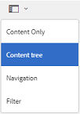

* Es wurden neue Tastaturbefehle eingeführt, zum Beispiel _(p)_ für die Navigation zur Eigenschaftsseite, _(e)_ zum Bearbeiten und _(Strg+c)_ zum Kopieren.
* Verbesserte Scrollfunktion, Lazy-Loading-Erlebnis in der Karten- und Listenansicht beim Durchsuchen einer großen Anzahl von Elementen.
* Erweiterte Kartenansicht mit Unterstützung für unterschiedlich große Karten basierend auf der Anzeigeeinstellung.

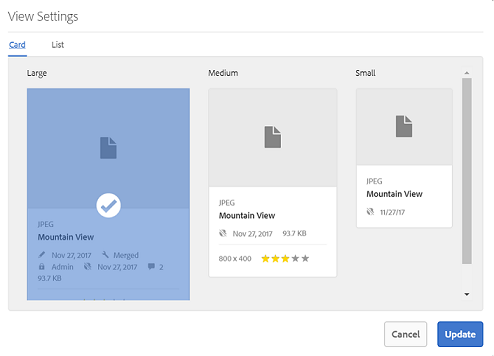

* Kartenansicht zeigt jetzt beim Bewegen des Mauszeigers über der Datumsangabe einen Datums-/Zeitstempel an.

* Erweiterte Spaltenansicht mit der Option **Weitere Details** unter den Asset-Momentaufnahmen, um zur Detailseite eines Assets navigieren zu können.

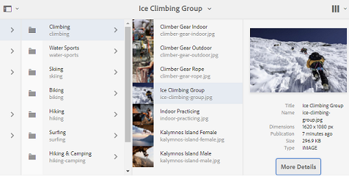

* Die Listenansicht zeigt jetzt standardmäßig Dateinamen der Assets in der ersten Spalte zusätzlich zu Informationen zu Gebietsschema, Asset-Typ, Dimensionen, Größe, Bewertung und Veröffentlichung. Es gibt neue **Anzeigeeinstellungen** zum Konfigurieren des Detailumfangs in der Listenansicht.

* Verbessertes Asset-Detailerlebnis mit der Möglichkeit, mit neuen Navigationsschaltflächen zwischen Assets vor und zurück zu wechseln, und mit Anzeige der Asset-Anzahl.

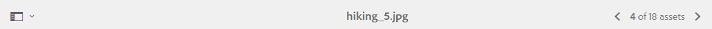

* Neue Möglichkeit zur Vorschau von Audio-Dateien, die aus AEM hochgeladen wurden, in der Detailseite des jeweiligen Assets.
* Neue Funktion „Zugehörige Assets“ auf der Seite „Asset-Eigenschaften“. Bei Assets, die zu anderen Quellen gehören, bzw. abgeleiteten Assets, die aus AEM in Brand Portal veröffentlicht wurden, bleiben die Beziehungen in Brand Portal erhalten, einschließlich der Links zu den zugehörigen Assets auf der Seite „Eigenschaften“.
* Neue Konfiguration verhindert, dass Nicht-Administrator-Benutzer öffentliche Sammlungen erstellen können. Unternehmen können sich an den Adobe-Support wenden, um diese Funktion für bestimmte Konten zu konfigurieren.

### Verbesserungen der Suche

* Neue Funktion hinzugefügt, um nach der Navigation zu einem Suchergebnis-Eintrag an dieselbe Position in den Suchergebnissen zurückzukehren, ohne die Suchabfrage neu starten zu müssen.
* Neuer Zähler für Suchergebnisse, um die Anzahl der Suchergebnisse anzuzeigen.
* Verbesserter Suchfilter für Dateitypen mit der Möglichkeit, Suchergebnisse basierend auf differenzierten MIME-Typen wie .jpg, .png und .psd zu filtern, anstatt die bisherigen Optionen wie Bilder, Dokumente, Multimedia zu verwenden.
* Erweiterter Suchfilter für Sammlungen mit genauen Zeitstempeln anstelle der bisherigen Zeitschiebereglerfunktion.
* Neue Filter für Zugriffstyp zum Suchen nach öffentlichen bzw. nicht-öffentlichen Sammlungen.

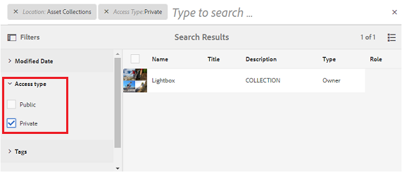

### Download-Optimierungen

* Einzelne große Dateien werden direkt heruntergeladen und nicht erst in einer ZIP-Datei gepackt. Dadurch werden Geschwindigkeit und Durchsatz verbessert.
* Die Download-Grenze für die Größe pro Datei beträgt für die Link-Freigabe-Funktion **1** GB.

* Benutzer können beim Herunterladen von Assets aus Brand Portal oder über freigegebene Links jetzt auswählen, ob sie nur die benutzerdefinierten oder die ursprünglichen  Dateien auswählen möchten, und vordefinierte Ausgabedarstellungen vermeiden, während sie Assets aus Brand Portal oder über die Funktion für freigegebene Links herunterladen.

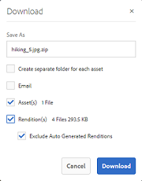

### Performance-Steigerung

* Bis zu 100 % höhere Asset-Download-Geschwindigkeit
* Bis zu 40 % schnellere Reaktion bei der Asset-Suche
* Bis zu 40 % bessere Browser-Leistung

**Hinweis:** Die genannten Verbesserungen wurden bei Tests in einem Labor gemessen.

### Erweiterte Berichterstellungsfunktionen

**Neuer Bericht zur Link-Freigabe**

Ein neuer Bericht wurde eingeführt, der Informationen zu freigegebenen Links bereitstellt. Der Bericht zur Link-Freigabe führt alle URLs zu Assets auf, die für interne und externe Benutzer im Unternehmen innerhalb des festgelegten Zeitrahmens freigegeben wurden. Zusätzlich enthält der Bericht Informationen zum Zeitpunkt der Link-Freigabe und zu dessen Ablaufdatum sowie dazu, wer den Link freigegeben hat.

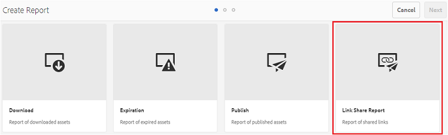

**Einstiegspunkt für den Zugriff auf den Verwendungsbericht geändert**

Der Verwendungsbericht wurde jetzt mit anderen Berichten konsolidiert und kann von der Konsole „Asset-Berichte“ angezeigt werden. Um auf die Konsole „Asset-Berichte“ zuzugreifen, klicken Sie im Admin-Tools-Bereich auf **Berichte erstellen/verwalten**.

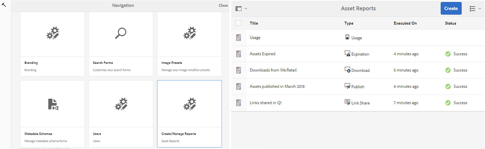

**Verbesserte Benutzererfahrung mit Berichten**
Die Berichterstellungsschnittstelle in Brand Portal wurde intuitiver und gibt Unternehmen mehr Kontrolle. Administratoren können nicht mehr nur verschiedene Berichte erstellen, sondern auch zuvor generierte Berichte erneut aufrufen und diese herunterladen oder löschen, da sie in Brand Portal gespeichert sind.

Alle Berichte können durch das Hinzufügen oder Entfernen standardmäßiger Spalten angepasst werden. Zudem können für die Berichte „Download“, „Ablauf“ und „Veröffentlichen“ benutzerdefinierte Spalten hinzugefügt werden, um den Detailgrad anzupassen.

### Verbesserte Admin-Tools

Verbesserte Eigenschaftenauswahl in den Admin Tools für Metadaten, Suche und Berichte mit Vervollständigungs- und Suchfunktion, um die Abläufe für Administratoren zu vereinfachen

### Weitere Verbesserungen

* Aus AEM 6.3.2.1 und 6.4 in Brand Portal veröffentlichte Assets können jetzt für alle Brand Portal-Benutzer verfügbar gemacht werden, indem das Kontrollkästchen „Öffentlichen Ordner veröffentlichen“ im Dialogfeld „AEM Assets Brand Portal-Replikation“ aktiviert wird.

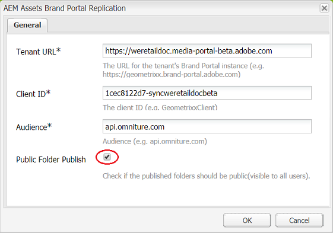

* Wenn Benutzer Zugriff auf Brand Portal anfragen, erhalten Administratoren zusätzlich zur Benachrichtigung im Brand Portal-Benachrichtigungsbereich eine E-Mail über die Zugriffsanforderung.

## Änderungen in Version 6.3.2 {#what-changed-in-3}

Brand Portal 6.3.2 enthält neue und erweiterte Funktionen, die die wichtigsten Kundenanfragen erfüllen und eine allgemeine Performance-Steigerung bringen.

### Anfordern von Zugriff auf Brand Portal {#request-access-to-brand-portal}

Benutzer können jetzt Zugriff auf Brand Portal anfordern. Eine entsprechende neue **Funktion** steht im Brand Portal-Anmeldebildschirm zur Verfügung.

Je nachdem, ob die Benutzer bereits eine Adobe ID haben oder zuerst eine Adobe ID erstellen müssen, können die Benutzer den entsprechenden Arbeitsablauf für die Anfrage befolgen. Brand Portal-Produkt-Administratoren werden in ihrem Benachrichtigungsbereich über diese Anfragen informiert und gewähren den Zugriff über die Adobe Admin Console.

Weitere Informationen finden Sie unter [Anfordern von Zugriff auf Brand Portal](../using/brand-portal.md#requestaccesstobrandportal).

### Erweiterung des Berichts über heruntergeladene Assets {#enhancement-in-the-assets-downloaded-report}

Der Bericht über heruntergeladene Assets zeigt jetzt an, wie viele Assets die einzelnen Benutzer innerhalb eines bestimmten Zeitraums heruntergeladen haben. Benutzer können diesen Bericht im CSV-Format herunterladen und Daten zur Gesamtanzahl der Downloads für ein lizenziertes Asset zusammenstellen.

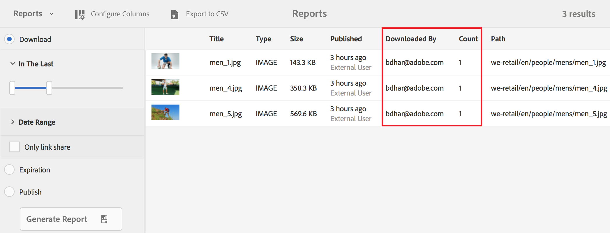

Weitere Informationen finden Sie in Schritt 3 und 6 unter [Erstellen und Verwalten weiterer Berichte](../using/brand-portal-reports.md#createandmanageadditionalreports).

### Wartungsbenachrichtigung in Brand Portal {#brand-portal-maintenance-notification}

Brand Portal zeigt jetzt einige Tage vor geplanten Wartungsaktivitäten ein entsprechendes Benachrichtigungsbanner an. Beispiel für eine Benachrichtigung:

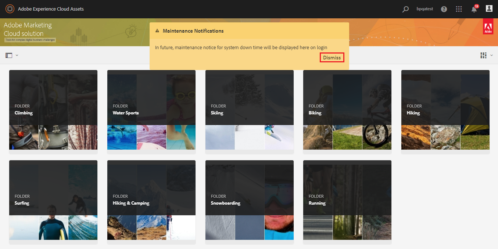

Weitere Informationen finden Sie in [Wartungsbenachrichtigung in Brand Portal](https://experienceleague.adobe.com/docs/experience-manager-brand-portal/using/introduction/brand-portal.html?lang=de).

### Erweiterungen für lizenzierte Assets, die über die Funktion „Asset-Freigabe“ freigegeben werden {#enhancement-for-licensed-assets-shared-using-the-link-share-feature}

Beim Herunterladen lizenzierter Assets mit der Funktion „Asset-Freigabe“ werden Sie jetzt aufgefordert, der Lizenzvereinbarung für diese Assets zuzustimmen.

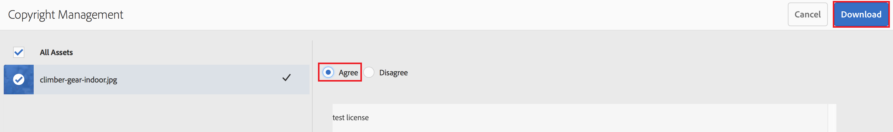

Weitere Informationen finden Sie in Schritt 12 unter [Freigeben von Assets als Link](../using/brand-portal-link-share.md#shareassetsasalink).

### Erweiterung der Funktion zur Benutzerauswahl {#user-picker-enhancement}

Die Funktion zur Benutzerauswahl wurde jetzt verbessert, um den Anforderungen von Kunden mit großen Benutzerzahlen gerecht zu werden.

### Änderungen beim Experience Cloud-Branding {#experience-cloud-branding-changes}

Brand Portal ist jetzt mit dem neuen Adobe Experience Cloud-Branding konform.

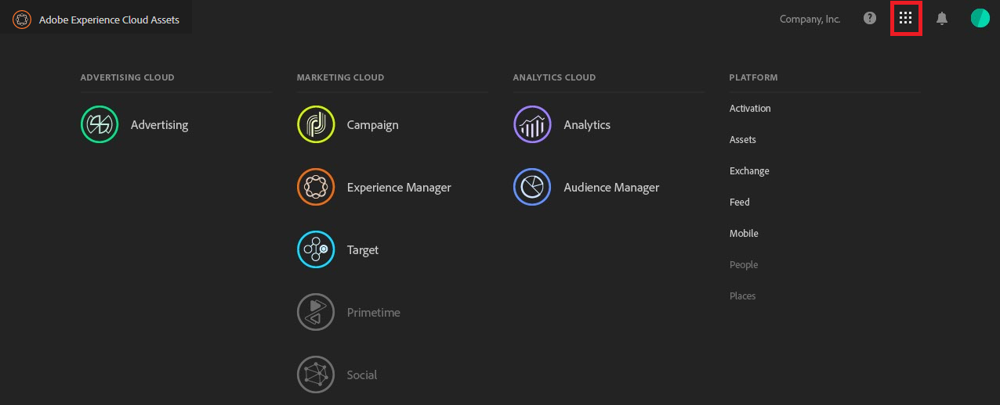

## Änderungen in Version 6.3.1 {#what-changed-in-4}

Brand Portal 6.3.1 enthält neue und erweiterte Funktionen, die die Abstimmung von Brand Portal mit AEM verbessern.

### Aktualisierte Benutzeroberfläche {#upgraded-user-interface}

Um das Brand Portal-Benutzererlebnis an AEM anzupassen, vollzieht Adobe einen Übergang zur Coral 3-Benutzeroberfläche. Durch diese Änderung wird die allgemeine Benutzerfreundlichkeit, einschließlich Navigation und Darstellung, verbessert.

#### Erweiterte Funktionen für die Navigation {#enhanced-navigational-experience}

* Schnellzugriff auf Admin-Tools über das neue Adobe-Logo:

* Produktnavigation mithilfe einer Überlagerung:

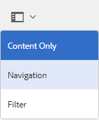

* Schnellnavigation zu übergeordneten Ordnern:

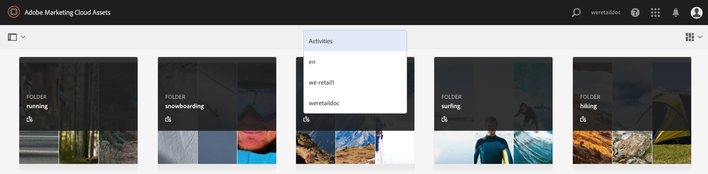

* Schnellsuche und Navigation zu erforderlichen Inhalten und Tools:

### Erweiterte Funktionen zum Durchsuchen {#enhanced-browsing-experience}

* Neue Spaltenansicht zum Durchsuchen verschachtelter Ordner:

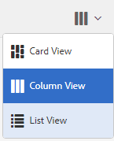 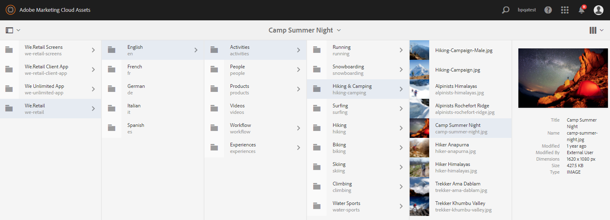

* In der Liste der Assets in einem Ordner wird das zuletzt hochgeladene Asset oben angezeigt.

### Erweiterte Funktionen zum Suchen {#enhanced-search-experience}

* Die neue Omnisearch-Funktion ermöglicht mithilfe automatischer Vorschläge beim Eingeben der Suchschlüsselwörter den schnellen Zugriff auf relevante Inhalte, Funktionen oder Tags. Omnisearch ist für alle Suchfunktionen verfügbar:

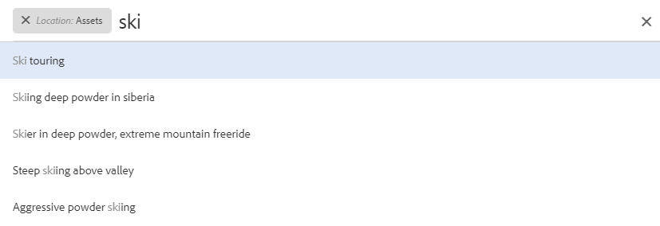

* Sie können außerdem Suchfilter zur Omni-Suche hinzufügen, um die Suche weiter einzugrenzen und zu beschleunigen.

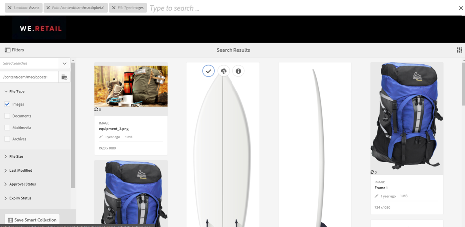

* Dank der neuen auf Asset-Bewertungen basierenden Suche können Sie anhand der in AEM Assets veröffentlichten Bewertungen (sofern verfügbar) nach Assets suchen.
* Die neue Suchfunktion für mehrere Werte akzeptiert die Eingabe mehrerer Suchbegriffe mit dem Operator UND, um die Suche zu beschleunigen.
* Durch die neue Suchoptimierungsfunktion können Sie die Relevanz der Suchergebnisse verbessern, sodass bestimmte Assets in den Suchergebnissen oben angezeigt werden.
* Die neue pfadbasierte Suche ermöglicht die Angabe eines Pfads zu einem verschachtelten Ordner, damit Sie nach Assets in diesem Ordner suchen können.

#### Neue Smart-Tag-basierte Suche {#new-smart-tags-based-search}

Wenn Bilder mit Smart-Tags aus AEM Assets in Brand Portal veröffentlicht werden, können Sie in Brand Portal anhand der Smart-Tag-Namen als Suchschlüsselwörter nach diesen Bildern suchen. Diese Funktion ist nur für Dateien verfügbar.

### Erweiterte Funktionen für Downloads {#enhanced-downloading-experience}

Nach dem Herunterladen eines verschachtelten Ordners können Sie die ursprüngliche Ordnerhierarchie beibehalten. Die Assets in einem verschachtelten Ordner können in einem Ordner heruntergeladen werden. Das Heruntergeladen in separaten Ordnern ist nicht mehr erforderlich.

### Verbesserte Leistung {#improved-performance}

Die Erweiterungen der Funktionen zum Durchsuchen, Suchen und Herunterladen verbessern die Brand Portal-Leistung erheblich.

### Neues Digital Rights Management für Assets {#new-digital-rights-management-for-assets}

Administratoren können vor der Freigabe von Assets Datum und Uhrzeit als Ablaufdatum festlegen. Abgelaufene Assets sind für Betrachter und Bearbeiter sichtbar, können aber nicht mehr heruntergeladen werden. Administratoren erhalten eine Benachrichtigung über abgelaufene Assets.

### Erweiterte Asset-Sortierung {#enhanced-asset-sorting}

Die Asset-Sortierung in einem Ordner in der Listenansicht ist nicht mehr auf die Anzahl der Assets auf der ersten Seite beschränkt. Stattdessen werden alle Assets sortiert, unabhängig davon, ob sie auf der ersten Seite angezeigt werden.

### Erweitertes Reporting {#reporting-capabilities}

Administratoren können drei Berichtstypen erstellen und verwalten – zu heruntergeladenen, abgelaufenen und veröffentlichten Assets. Zudem können die Spalten im Bericht konfiguriert und die Berichte als CSV-Datei exportiert werden.

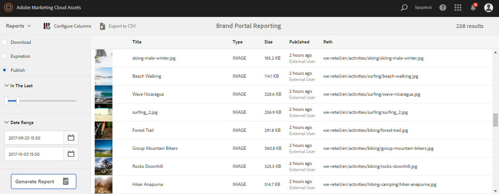

### Zusätzliche Metadaten {#additional-metadata}

Brand Portal 6.3.1 führt zusätzliche Metadaten ein, die auch in AEM Assets 6.3 enthalten sind. Die Metadaten, die auf der Seite „Asset-Eigenschaften“ angezeigt werden, können mit dem Metadatenschema-Editor festlegt werden. Asset-Metadaten sind nicht für Benutzer sichtbar, die Assets als Freigabe über einen externen Link erhalten und die Assets nur mithilfe der Linkfreigabe-URL in der Vorschau anzeigen sowie herunterladen können.

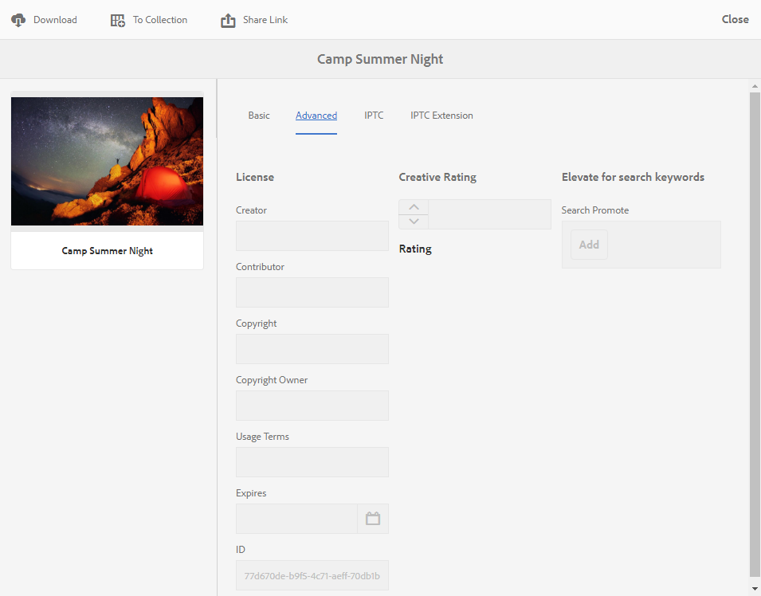

### Weitere Funktionen für Administratoren {#additional-capabilities-for-administrators}

* Vor dem Abschließen der Anpassungen für den Anmeldebildschirm-Hintergrund können Administratoren die Änderungen in der Vorschau anzeigen.

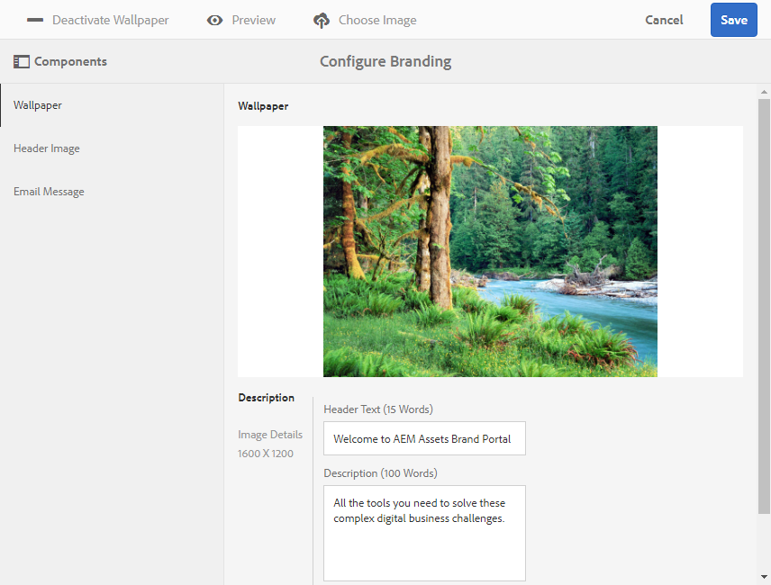

* Wenn ein Administrator neue Benutzer zum Brand Portal-Konto hinzugefügt hat, müssen diese keine Einladungen annehmen, um zu Brand Portal hinzugefügt zu werden. Das Hinzufügen erfolgt automatisch.

### Neue Veröffentlichungsfunktionen in AEM Assets 6.3 {#new-publishing-capabilities-in-aem-assets}

* AEM-Administratoren können mithilfe von AEM 6.3 SP 1-CFP 1 (6.3.1.1) (ab 4. Quartal 2017 verfügbar) Metadatenschemata aus AEM Assets in Brand Portal veröffentlichen.

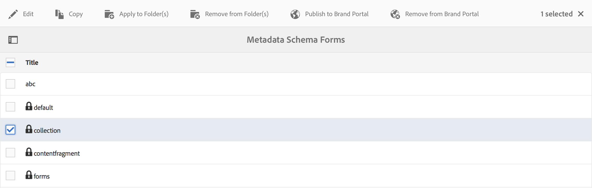

* AEM-Administratoren können mithilfe von AEM 6.2 SP1-CFP7 und AEM 6.3 SP 1-CFP 1 (6.3.1.1) alle Tags aus AEM Assets in Brand Portal veröffentlichen.

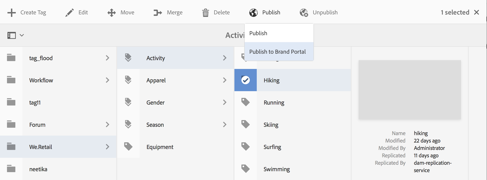

* Sie können aus AEM Assets Sammlungen und Assets veröffentlichen, die Tags (einschließlich Smart-Tags) enthalten. Sie können diese Tags anschließend als Suchschlüsselwörter verwenden, um in Brand Portal nach diesen Sammlungen und Assets zu suchen.
