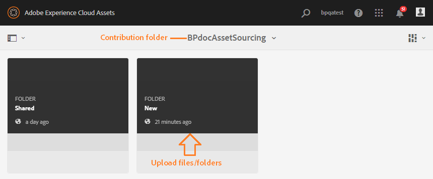
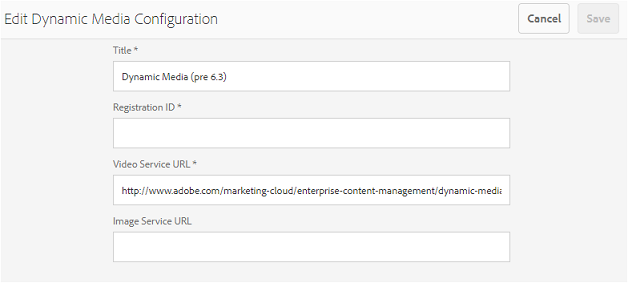
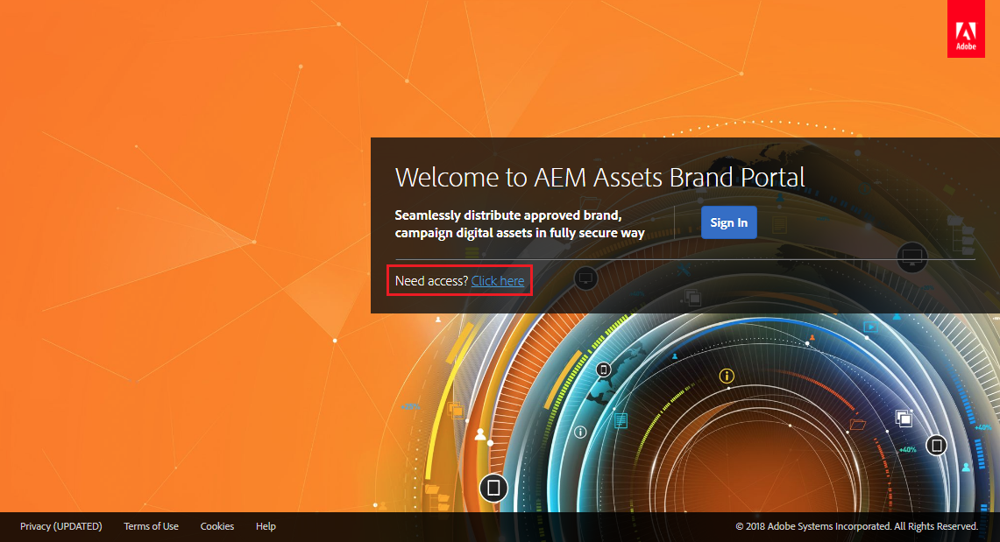
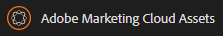

# Neue Funktionen in AEM Assets Brand Portal {#what-s-new-in-aem-assets-brand-portal}

Mit Adobe Experience Manager (AEM) Assets Brand Portal können Sie problemlos genehmigte Kreativ-Assets abrufen, kontrollieren und sicher an externe Parteien und interne Geschäftsbenutzer auf allen Geräten verteilen. Brand Portal ermöglicht eine effizientere Asset-Freigabe, schnellere Time-to-Market für Assets sowie verringerte Risiken von Nicht-Compliance und unbefugtem Zugriff. Adobe arbeitet an der Verbesserung des allgemeinen Brand Portal-Erlebnisses. Nachfolgend erfahren Sie, welche Funktionen und Erweiterungen eingeführt werden.

## Änderungen in Version 6.4.6 {#what-changed-in-646}

In Brand Portal 6.4.6 wurde der Autorisierungskanal zwischen AEM Assets und Brand Portal geändert. Brand Portal wird jetzt von AEM Assets Cloud Service, AEM Assets 6.3 und hher unterstützt. In AEM Assets 6.3 und höher wurde Brand Portal zuvor in der klassischen Benutzeroberfläche über das alte OAuth-Gateway konfiguriert. Das Gateway ruft mithilfe des JWT-Token-Austauschs ein IMS-Zugriffs-Token zur Autorisierung ab. AEM Assets wird jetzt mit Brand Portal über Adobe Devloper Console konfiguriert, die ein IMS-Token zur Authentifizierung Ihres Brand Portal-Mandanten abruft.

<!-- The steps to configure integration are different depending on your AEM version, and whether you are configuring for the first-time, or upgrading the existing integration:
-->

<!--
  
   | **AEM Version** |**New Integration** |**Upgrade Integration** |
|---|---|---|
| **AEM 6.5** |[Create new integration](../using/brand-portal-configure-integration-65.md) |[Upgrade existing integration](../using/brand-portal-configure-integration-65.md#upgrade-integration-65) | 
| **AEM 6.4** |[Create new integration](../using/brand-portal-configure-integration-64.md) |[Upgrade existing integration](../using/brand-portal-configure-integration-64.md#upgrade-integration-64) | 
| **AEM 6.3** |[Create new integration](../using/brand-portal-configure-integration-63.md) |[Upgrade existing integration](../using/brand-portal-configure-integration-63.md#upgrade-integration-63) | 
| **AEM 6.2** |Contact Support |Contact Support | 

   -->

Die Schritte zum Konfigurieren von AEM Assets mit Brand Portal unterscheiden sich je nach Ihrer AEM-Version und davon, ob Sie zum ersten Mal eine Konfiguration durchführen oder die vorhandenen Konfigurationen aktualisieren:

<!--| **AEM Version** |**New Configuration** |**Upgrade Configuration** |
|---|---|---|
| **AEM 6.5 (6.5.4.0 and above)** |[Create configuration](../using/brand-portal-configure-integration-65.md) |[Upgrade configuration](../using/brand-portal-configure-integration-65.md#upgrade-integration-65) | 
| **AEM 6.4 (6.4.8.0 and above)** |[Create configuration](../using/brand-portal-configure-integration-64.md) |[Upgrade configuration](../using/brand-portal-configure-integration-64.md#upgrade-integration-64) | 
| **AEM 6.3 (6.3.3.8 and above)** |[Create configuration](../using/brand-portal-configure-integration-63.md) |[Upgrade configuration](../using/brand-portal-configure-integration-63.md#upgrade-integration-63) | 
| **AEM 6.2** |Contact Support |Contact Support | 
-->

<!-- AEM Assets configuration with Brand Portal on Adobe I/O is supported on:
* AEM 6.5.4.0 and above
* AEM 6.4.8.0 and above
* AEM 6.3.3.8 and above -->

| **AEM-Version** | **Neue Konfiguration** | **Upgrade der Konfiguration** |
|---|---|---|
| **AEM Assets as a Cloud Service** | [Konfiguration erstellen](https://docs.adobe.com/content/help/en/experience-manager-cloud-service/assets/brand-portal/configure-aem-assets-with-brand-portal.html) | - |
| **AEM 6.5 (6.5.4.0 und höher)** | [Konfiguration erstellen](https://docs.adobe.com/content/help/de-DE/experience-manager-65/assets/brandportal/configure-aem-assets-with-brand-portal.translate.html) | [Upgrade der Konfiguration](https://docs.adobe.com/content/help/de-DE/experience-manager-65/assets/brandportal/configure-aem-assets-with-brand-portal.translate.html#upgrade-integration-65) |
| **AEM 6.4 (6.4.8.0 und höher)** | [Konfiguration erstellen](https://docs.adobe.com/content/help/de-DE/experience-manager-64/assets/brandportal/configure-aem-assets-with-brand-portal.html) | [Upgrade der Konfiguration](https://docs.adobe.com/content/help/de-DE/experience-manager-64/assets/brandportal/configure-aem-assets-with-brand-portal.html#upgrade-integration-64) |
| **AEM 6.3 (6.3.3.8 und höher)** | [Konfiguration erstellen](https://helpx.adobe.com/de/experience-manager/6-3/assets/using/brand-portal-configuring-integration.html) | [Upgrade der Konfiguration](https://helpx.adobe.com/de/experience-manager/6-3/assets/using/brand-portal-configuring-integration.html#Upgradeconfiguration) |
| **AEM 6.2** | Support kontaktieren | Support kontaktieren |

>[!NOTE]
>
>Es wird empfohlen, Ihre AEM-Instanz auf das neueste Service Pack zu aktualisieren.

Siehe aktuelle [Brand Portal-Versionshinweise](brand-portal-release-notes.md).

Siehe [Häufig gestellte Fragen zum Brand Portal](brand-portal-faqs.md).

## Änderungen in 6.4.5 {#what-changed-in-645}

Brand Portal 6.4.5 ermöglicht es Brand Portal-Benutzern (externe Agenturen/Teams), Inhalte in Brand Portal hochzuladen und in AEM Assets zu veröffentlichen, ohne dass sie auf die Autorenumgebung zugreifen müssen. Diese Funktion wird als **[Asset-Beschaffung in Brand Portal](brand-portal-asset-sourcing.md)**bezeichnet und verbessert die Kundenerlebnisse, indem eine bidirektionale Methode zur Verfügung gestellt wird, mit der Benutzer Assets beitragen und für andere rund um des Globus verteilte Brand Portal-Benutzer freigeben können.

### Asset-Beschaffung in Brand Portal {#asset-sourcing-in-bp}

Mit der Asset-Beschaffung können AEM-Benutzer (Administratoren/Benutzer ohne Administratorrechte) neue Ordner mit der zusätzlichen Eigenschaft **Asset-Beitrag** erstellen, um sicherzustellen, dass die neu erstellten Ordner von Brand Portal-Benutzern für die Übermittlung von Assets nutzbar sind. Dadurch wird automatisch ein Workflow ausgelöst, mit dem zwei weitere Unterordner namens „NEU“ und „FREIGEGEBEN“ im neu erstellten **Beitragsordner** erstellt werden.

Der AEM-Benutzer definiert dann die Anforderung, indem er eine [Kurzbeschreibung](brand-portal-configure-contribution-folder-properties.md) der Asset-Typen, die dem Beitragsordner hinzugefügt werden sollen, sowie eine Reihe von [Grundlinien-Assets](brand-portal-upload-baseline-assets.md) in den Ordner **FREIGEGEBEN** hochlädt, um sicherzustellen, dass Brand Portal-Benutzer über die benötigten Referenzinformationen verfügen. Der Administrator kann aktiven Brand Portal-Benutzern anschließend Zugriff auf den Beitragsordner gewähren, bevor der neu erstellte **Beitragsordner** in Brand Portal veröffentlicht wird.

Nachdem die Benutzer Inhalte zum Ordner **NEU** hinzugefügt haben, können sie den Beitragsordner wieder in der AEM-Autorenumgebung veröffentlichen. Bitte beachten Sie, dass es einige Minuten dauern kann, bis der Import abgeschlossen ist und die neu veröffentlichten Inhalte in AEM Assets angezeigt werden.

Darüber hinaus bleiben alle vorhandenen Funktionen unverändert. Brand Portal-Benutzer können Assets aus dem Beitragsordner sowie aus anderen Ordnern anzeigen, suchen und herunterladen, für die sie über entsprechende Berechtigungen verfügen. Administratoren können außerdem den Beitragsordner freigeben, Eigenschaften ändern und Assets zu Sammlungen hinzufügen.

>[!NOTE]
>
>Die Asset-Beschaffung in Brand Portal wird ab AEM 6.5.2.0 unterstützt.
>
>Die Funktion wird in früheren Versionen – AEM 6.3 und AEM 6.4 – nicht unterstützt.

### Hochladen von Assets in den Beitragsordner {#upload-assets-in-bp}

Brand Portal-Benutzer mit entsprechenden Berechtigungen können die [Asset-Anforderungen herunterladen](brand-portal-download-asset-requirements.md), um die Notwendigkeit von Beiträgen zu verstehen, und mehrere Assets oder Ordner, die mehrere Assets enthalten, in den Beitragsordner hochzuladen. Beachten Sie jedoch, dass Brand Portal-Benutzer Assets nur in den Unterordner **NEU** hochladen können. Der Ordner **FREIGEGEBEN** dient zur Verteilung von Anforderungen und Grundlinien-Assets. Siehe [Hochladen von Assets in den Beitragsordner](brand-portal-upload-assets-to-contribution-folder.md)

### Veröffentlichen von Beitragsordnern in AEM Assets {#publish-assets-to-aem}

Nachdem der Upload in den Ordner **NEU** abgeschlossen ist, können Brand Portal-Benutzer den Beitragsordner erneut in AEM veröffentlichen. Bitte beachten Sie, dass es einige Minuten dauern kann, bis der Import abgeschlossen ist und die neu veröffentlichten Inhalte/Assets in AEM Assets angezeigt werden. Siehe [Veröffentlichen von Beitragsordnern in AEM Assets](brand-portal-publish-contribution-folder-to-aem-assets.md)

## Änderungen in 6.4.4 {#what-changed-in-644}

Version 6.4.4 von Brand Portal konzentriert sich auf Verbesserungen der Textsuche und von Kunden häufig gewünschte Funktionen. Siehe aktuelle [Brand Portal-Versionshinweise](brand-portal-release-notes.md).

### Verbesserungen der Suche {#search-enhancements}

Ab Version 6.4.4 unterstützt Brand Portal die Suche nach Textteilen über das Eigenschaftsprädikat im Filterbereich. Um die Suche nach Textteilen zu erlauben, müssen Sie die **Teilsuche** im Eigenschaftsprädikat im Suchformular aktivieren.

Lesen Sie weiter, um mehr über die Suche nach Textteilen und Suche mit Platzhalter zu erfahren.

#### Suche nach Satzteilen             {#partial-phrase-search}

Sie können nach Assets suchen, indem Sie nur einen Teil – d. h. ein oder zwei Wörter – des gesuchten Satzes in den Filterbereich eingeben.

**Anwendungsfall**
Die Suche nach Satzteilen ist hilfreich, wenn Sie sich nicht sicher sind, wie die genaue Wortfolge im gesuchten Satz lautet.

Beispiel: Wenn Ihr Suchformular in Brand Portal das Eigenschaftsprädikat für Teilsuche nach einem Asset-Titel anwendet, werden nach Angabe des Begriffs **Lager** alle Assets mit dem Wort Lager im Titelsatz zurückgegeben.

#### Suche mit Platzhalter {#wildcard-search}

In Brand Portal können Sie das Sternchen (*) in der Suchanfrage zusammen mit einem Teil des Wortes in der gesuchten Phrase verwenden.

**Anwendungsfall**
Wenn Sie den genauen Wortlaut des gesuchten Satzes nicht kennen, können Sie eine Suche mit Platzhaltern durchführen, um die Lücken in der Suchabfrage zu füllen.

Beispielsweise werden durch die Angabe von **klettern*** alle Assets zurückgegeben, deren Titelphrase Wörter enthält, die mit den Zeichen **klettern** beginnen, wenn das Suchformular in Brand Portal das Eigenschaftsprädikat für Teilsuche auf Asset-Titel anwendet.

Auch gilt Folgendes:

* Durch die Angabe von ***klettern** werden alle Assets zurückgegeben, deren Titelphrase Wörter enthält, die mit den Zeichen **klettern** enden. 

* Durch die Angabe von ***klettern*** werden alle Assets zurückgegeben, deren Titelphrase Wörter enthält, die die Zeichen **klettern** enthalten.

>[!NOTE]
>
>Nach Aktivierung des Kontrollkästchens **Teilsuche** wird **Groß-/Kleinschreibung ignorieren** standardmäßig aktiviert.

## Änderungen in 6.4.3 {#what-changed-in}

Version 6.4.3 von Brand Portal bietet Unternehmen neben der Mandanten-ID einen alternativen Alias für die Brand Portal-Zugriffs-URL, eine neue Ordnerhierarchiekonfiguration, Verbesserungen bei der Videounterstützung, die geplante Veröffentlichung aus der AEM-Autoreninstanz in Brand Portal, betriebliche Verbesserungen und die Umsetzung von Kundenwünschen.

### Ordnerhierarchienavigation für Benutzer ohne Administratorrechte

Administratoren können jetzt konfigurieren, wie Ordner für Benutzer ohne Administratorrechte (Bearbeiter, Betrachter und Gastbenutzer) bei der Anmeldung angezeigt werden.  Die Konfiguration [Ordnerhierarchie aktivieren](../using/brand-portal-general-configuration.md) wird in den **Allgemeinen Einstellungen** im Admin Tools-Bereich hinzugefügt. Wenn die Konfiguration:

* **aktiviert** ist, ist die Ordnerstruktur ab dem Stammordner für Nicht-Administratoren sichtbar. Sie können also genauso wie Administratoren navigieren.
* **deaktiviert** ist, werden auf der Einstiegsseite nur die freigegebenen Ordner angezeigt.

**Der Anwendungsfall**

Wenn die Funktion [Ordnerhierarchie aktivieren](../using/brand-portal-general-configuration.md) aktiviert ist, können Sie besser zwischen verschiedenen Ordnern mit demselben Namen unterscheiden, die über verschiedene Hierarchien freigegeben werden. Bei der Anmeldung sehen Nicht-Administratoren nun die virtuellen übergeordneten (und untergeordneten) Ordner der freigegebenen Ordner.
 

Die freigegebenen Ordner werden innerhalb der jeweiligen Verzeichnisse in virtuellen Ordnern angeordnet. Sie können diese virtuellen Ordner an einem Schlosssymbol erkennen.

Beachten Sie, dass das Standardminiaturbild der virtuellen Ordner das Miniaturbild des ersten freigegebenen Ordners ist.

### Suche in einer bestimmten Ordnerhierarchie oder in einem bestimmten Ordnerpfad

Die Eigenschaft **Pfadbrowser** wird in das Suchformular eingeführt, um das Suchen von Assets in einem bestimmten Verzeichnis zu ermöglichen. Der Standardsuchpfad der Sucheigenschaft für den Pfadbrowser lautet `/content/dam/mac/<tenant-id>/`. Dieser kann durch Bearbeiten des Standardsuchformulars konfiguriert werden.

* Administratoren können über den Pfadbrowser zu einem beliebigen Verzeichnis in Brand Portal navigieren.
* Nicht-Administratoren können über den Pfadbrowser nur zu den Ordnern navigieren, die für sie freigegeben sind, und wieder zurück zu den übergeordneten Ordnern.
Zum Beispiel wird `/content/dam/mac/<tenant-id>/folderA/folderB/folderC` für einen Nicht-Administrator freigegeben. Der Benutzer kann mithilfe des Pfadbrowsers innerhalb von OrdnerC nach Assets suchen. Dieser Benutzer kann auch zu OrdnerB und OrdnerA navigieren (da es sich um übergeordnete Elemente des Ordners handelt, der für den Benutzer freigegeben ist).

**Der Anwendungsfall**

Sie können die Asset-Suche nun in einem bestimmten Ordner einschränken, zu dem Sie navigiert sind, anstatt die Einschränkung angefangen beim Stammordner anzuwenden.

Beachten Sie, dass die Suche in diesen Ordnern nur Suchergebnisse aus Assets zurückgibt, die für den Benutzer freigegeben wurden.

### Unterstützung von Dynamic Media Video-Ausgabeformaten

Benutzer, deren AEM-Autoreninstanz sich im Dynamic Media-Hybridmodus befindet, können – zusätzlich zu den Originalvideodateien – Dynamic Media-Ausgabeformate in der Vorschau ansehen und herunterladen.

Um Dynamic Media Ausgabeformate als Vorschau für bestimmte Mandantenkonten anzeigen (oder herunterladen) zu können, müssen Administratoren die **Dynamic Media-Konfiguration** (Videodienst-URL (DM-Gateway-URL) und Registrierungs-ID zum Abrufen des dynamischen Videos) in der Konfiguration **Video** im Admin Tools-Bereich angeben.

**Die Anwendungsfälle**
Dynamische Medien können in der Vorschau angezeigt werden:

* Asset-Detailseite
* Asset-Kartenansicht
* Linkfreigabe-Vorschauseite

Dynamic Media-Videokodierungen können heruntergeladen werden über:

* Brand Portal
* Freigegebenen Link

### Geplante Veröffentlichung in Brand Portal

Der Veröffentlichungs-Workflow für Assets (und Ordner) aus der [AEM (6.4.2.0)](https://helpx.adobe.com/de/experience-manager/6-4/release-notes/sp-release-notes.html#main-pars_header_9658011)-Autoreninstanz in Brand Portal kann für einen späteren Zeitpunkt (Datum, Uhrzeit) geplant werden.

Entsprechend können veröffentlichte Assets zu einem späteren Zeitpunkt aus dem Portal entfernt werden, indem der Workflow zum Rückgängigmachen der Veröffentlichung in Brand Portal geplant wird.

### Konfigurierbarer Mandantenalias in URL

Unternehmen können ihre Portal-URL mit einem alternativen Präfix in der URL anpassen. Um einen Alias für einen Mandantenamen in der vorhandenen Portal-URL zu erhalten, müssen Unternehmen sich mit dem Adobe-Support in Verbindung setzen.

Beachten Sie, dass nur das Präfix der Brand Portal-URL angepasst werden kann und nicht die gesamte URL.\
Für eine Organisation mit der vorhandenen Domäne **geomettrix.brand-portal.adobe.com** kann beispielsweise auf Anfrage die Domäne **geomettrixinc.brand-portal.adobe.com** erstellt werden.

Eine AEM-Autoreninstanz kann jedoch nur mit der Mandanten-ID-URL [konfiguriert](https://helpx.adobe.com/de/experience-manager/6-5/assets/using/brand-portal-configuring-integration.html) werden und nicht mit einer (alternativen) Mandantenalias-URL.

**Der Anwendungsfall**
Unternehmen können ihre Branding-Anforderungen erfüllen, indem sie ihre Portal-URL anpassen, anstatt die von Adobe bereitgestellte URL beizubehalten.

### Optimierter Download

In Adobe Experience Manager Assets Brand Portal 6.4.3 wurde der Download vereinfacht, sodass in den folgenden Situationen weniger Klicks notwendig sind und weniger Warnungen angezeigt werden:

* Entscheidung, dass nur die Ausgabeformate heruntergeladen werden (und nicht die Original-Assets).
* Herunterladen der Assets, wenn der Zugriff auf die Original-Ausgabeformate eingeschränkt ist.

## Änderungen in 6.4.2 {#what-changed-in-1}

Die Brand Portal-Version 6.4.2 umfasst eine Reihe von Funktionen, die die Bedürfnisse von Organisationen hinsichtlich der Asset-Verteilung erfüllen. Durch Bereitstellung eines Gastzugangs und optimale Download-Zeiten dank beschleunigter Downloads können Unternehmen eine große Anzahl an weltweit verteilten Benutzern erreichen. Darüber hinaus bietet Brand Portal Organisationen durch neue Konfigurationsoptionen für Administratoren, einen neu hinzugefügten Bericht und bessere Berücksichtigung von Kundenanforderungen eine größere Kontrolle.

### Gastzugang

AEM Brand Portal gestattet den Gastzugang für das Portal. Ein Gastbenutzer benötigt keine Anmeldeinformationen, um das Portal aufzurufen, und kann auf sämtliche öffentliche Ordner und Sammlungen zugreifen und diese herunterladen. Gastbenutzer können Assets zu ihrer Lightbox (private Sammlung) hinzufügen und diese herunterladen. Sie können Smart-Tag-basierte Suchen und Sucheigenschaften, die von Administratoren festgelegt wurden, anzeigen. Die Gastsitzung gestattet es Benutzern jedoch nicht, Sammlungen und gespeicherte Suchen zu erstellen oder weiter freizugeben, auf die Einstellungen für Ordner und Sammlungen zuzugreifen und Assets als Links freizugeben.

In einer Organisation sind mehrere gleichzeitige Gastsitzungen zulässig, deren Zahl ist jedoch auf 10 % des Gesamtbenutzerkontingents pro Organisation beschränkt.

Eine Gastsitzung bleibt für 2 Stunden aktiv. Infolgedessen wird der Status der Lightbox auch bis 2 Stunden nach Beginn der Sitzung beibehalten. Nach 2 Stunden muss die Gastsitzung neu gestartet werden, d. h. der Lightbox-Status geht verloren.

### Beschleunigte Downloads

Brand Portal-Benutzer können mit der IBM Aspera Connect-basierten Downloadbeschleunigung – unabhängig von ihrem globalen Standort – bis zu 25-mal höhere Geschwindigkeiten und eine unterbrechungsfreie Download-Performance erzielen. Um Assets schneller aus Brand Portal oder über den freigegebenen Link herunterzuladen, müssen Benutzer die Option **Downloadbeschleunigung aktivieren** im Dialogfeld „Herunterladen“ auswählen, sofern die Downloadbeschleunigung im Unternehmen aktiviert ist.

Um die IBM Aspera Connect-basierte Download-Beschleunigung für Benutzer der Organisation zu aktivieren, müssen Administratoren die Option **Download-Beschleunigung aktivieren** (die standardmäßig deaktiviert ist) unter [Allgemeine Einstellungen](brand-portal-general-configuration.md#allow-download-acceleration) im Admin Tools-Bereich auswählen. Weitere Informationen zu den Voraussetzungen und den Schritten zur Fehlerbehebung bei Problemen mit dem schnelleren Download von Asset-Dateien von Brand Portal und über freigegebene Links finden Sie unter [Anleitung zum Beschleunigen von Downloads von Brand Portal](../using/accelerated-download.md#main-pars-header).

### Bericht „Benutzeranmeldungen“

Es wurde ein neuer Bericht zum Nachverfolgen von Benutzeranmeldungen eingeführt. Der Bericht **Benutzeranmeldungen** bietet Organisationen die Möglichkeit, die delegierten Administratoren und andere Benutzer von Brand Portal zu überwachen und zu kontrollieren.

Der Bericht enthält den Anzeigenamen, die E-Mail-IDs, die Rollen (Admin, Betrachter, Bearbeiter, Gast), die Gruppen, Angaben zur letzten Anmeldung, den Aktivitätsstatus und die Anzahl der Anmeldungen von jedem Benutzer seit der Bereitstellung von Brand Portal 6.4.2 bis zum Zeitpunkt der Berichterstellung. Administratoren können den Bericht als .csv-Datei exportieren. Der Bericht „Benutzeranmeldungen“ gestattet in Verbindung mit anderen Berichten eine genauere Überwachung der Benutzerinteraktionen mit den genehmigten Brand-Ressourcen und gewährleistet so die Einhaltung von Vorschriften der Corporate Compliance Offices.

### Zugriff auf die Original-Ausgabeformate

Administratoren können den Zugriff auf die Original-Bilddateien (.jpeg, .tiff, .png, .bmp, .gif, .pjpeg, x-portable-anymap, x-portable-bitmap, x-portable-graymap, x-portable-pixmap, x-rgb, x-xbitmap, x-xpixmap, x-icon, image/photoshop, image/x-photoshop, .psd, image/vnd.adobe.photoshop) einschränken und Zugriff auf Ausgabeformate mit einer niedrigen Auflösung erteilen, die aus Brand Portal oder über einen freigegebenen Link heruntergeladen werden. Dieser Zugriff kann auf Benutzergruppenebene über die Registerkarte „Gruppen“ auf der Seite „Benutzerrollen“ im Admin Tools-Bereich gesteuert werden.

* Standardmäßig sind alle Benutzer berechtigt, Original-Ausgabeformate herunterzuladen, da die Option „Zugriff auf Original“ für alle aktiviert ist.
* Administratoren müssen die Auswahl der entsprechenden Kontrollkästchen deaktivieren, um zu verhindern, dass eine Gruppe von Benutzern auf Original-Ausgabeformate zugreift.
* Falls ein Benutzer Mitglied mehrerer Gruppen ist, eine dieser Gruppen aber über Einschränkungen verfügt, gelten die Einschränkungen für diesen Benutzer.
* Die Einschränkungen gelten nicht für Administratoren, auch wenn sie Mitglieder von eingeschränkten Gruppen sind.
* Die Berechtigungen des Benutzers, der Assets als Link freigibt, gelten auch für die Benutzer, die die Assets über die freigegebenen Links herunterladen.

### Ordnerhierarchiepfad in Karten- und Listenansichten

Auf den Karten von Ordnern in der Kartenansicht werden für Benutzer ohne Administratorrechte (Bearbeiter, Betrachter und Gastbenutzer) jetzt Informationen zur Ordnerhierarchie angezeigt. Diese Funktion informiert die Benutzer über den Speicherort der Ordner, auf die sie zugreifen, in Bezug auf die übergeordnete Hierarchie.

Informationen zur Ordnerhierarchie sind besonders hilfreich, um die Ordner zu unterscheiden, deren Namen anderen Ordnern ähneln, die in einer anderen Ordnerhierarchie freigegeben sind. Wenn Benutzer ohne Administratorrechte nicht die Ordnerstruktur der für sie freigegebenen Assets berücksichtigen, können Assets bzw. Ordner mit denselben Namen für Verwirrung sorgen.

* Die auf den entsprechenden Karten angezeigten Pfade werden so gekürzt, dass sie zu den Kartengrößen passen. Die Benutzer können den vollständigen Pfad jedoch in einer QuickInfo sehen, wenn sie den Mauszeiger über den verkürzten Pfad bewegen.

In der Listenansicht wird der Ordnerpfad der Assets in einer Spalte für alle Benutzer von Brand Portal angezeigt.

### Option „Überblick“ zur Anzeige der Asset-Eigenschaften

Brand Portal stellt Benutzern ohne Administratorrechte (Bearbeitern, Betrachtern, Gastbenutzern) mit der Option „Überblick“ eine Funktion zum Anzeigen von Asset-Eigenschaften von ausgewählten Assets/Ordnern bereit. Die Option „Überblick“ finden Sie an folgenden Stellen:

1. In der Symbolleiste am oberen Rand des ausgewählten Assets/Ordners
2. In der Dropdown-Liste des ausgewählten Leistenselektors

Bei Auswahl der Option „Überblick“ bei ausgewähltem Asset/Ordner können die Benutzer den Titel, den Pfad und den Zeitpunkt der Asset-Erstellung sehen. Wohingegen die Benutzer bei Auswahl der Option „Überblick“ auf der Asset-Detailseite die Metadaten des Assets sehen können.

## Neue Konfigurationen

Es wurden sechs neue Konfigurationen hinzugefügt, damit Administratoren folgende Funktionen für bestimmte Mandanten aktivieren bzw. deaktivieren können:

* Zulassen des Gastzugangs
* Zugriffsanfrage für Brand Portal durch Benutzer erlauben
* Löschen von Assets von Brand Portal durch Administratoren zulassen
* Erstellung öffentlicher Sammlungen zulassen
* Erstellung öffentlicher Smart-Sammlungen zulassen
* Downloadbeschleunigung aktivieren

Die zuvor genannten Konfigurationen sind unter „Zugriff“ und „Allgemeine Einstellungen“ im Admin Tools-Bereich verfügbar.

### Adobe i/O-Benutzeroberfläche zum Konfigurieren von oAuth-Integrationen

Ab Brand Portal 6.4.2 wird die Adobe.io-Benutzeroberfläche [https://legacy-oauth.cloud.adobe.io/](https://legacy-oauth.cloud.adobe.io/) zur Erstellung der JWT-Anwendung verwendet, über die OAuth-Integrationen so konfiguriert werden können, dass sie eine AEM Assets-Integration in Brand Portal unterstützen. Previously, the UI for configuring OAuth integrations was hosted in `https://marketing.adobe.com/developer/`. Weitere Informationen zur Integration von AEM Assets mit Brand Portal, um Assets und Sammlungen in Brand Portal zu veröffentlichen, finden Sie unter [Konfigurieren der Integration von AEM Assets mit Brand Portal](https://docs.adobe.com/content/help/de-DE/experience-manager-64/assets/brandportal/configure-aem-assets-with-brand-portal.html).

## Verbesserungen der Suche

Administratoren können die Eigenschaftsprädikate so konfigurieren, dass nicht zwischen Groß- und Kleinschreibung unterschieden wird, indem sie das aktualisierte Eigenschaftsprädikat nutzen. Dieses verfügt über ein Kontrollkästchen zum Ignorieren von Groß- und Kleinschreibung. Die Option ist für Eigenschaftsprädikat und für Eigenschaftsprädikat mit mehreren Werten verfügbar.\
Eine Suche, bei der nicht zwischen Groß- und Kleinschreibung unterschieden wird, ist vergleichsweise langsamer als die Standardsuche nach Eigenschaftsprädikat. Wenn es im Suchfilter zu viele Prädikate gibt, bei denen nicht zwischen Groß- und Kleinschreibung unterschieden wird, kann sich die Suche verlangsamen. Daher ist es ratsam, Suchen, bei denen nicht zwischen Groß- und Kleinschreibung unterschieden wird, umsichtig zu verwenden.

## Änderungen in 6.4.1 {#what-changed-in-2}

Brand Portal 6.4.1 ist eine Plattform-Upgrade-Version, die mehrere neue Funktionen und wichtige Erweiterungen bei den Funktionen zum Durchsuchen und Suchen sowie Performancesteigerungen mit sich bringt, um die Bereitstellung herausragender Kundenerlebnisse zu ermöglichen.

### Erweiterte Funktionen zum Durchsuchen

* Neue Inhaltsstrukturleiste zur schnellen Navigation in Asset-Hierarchien.

* Es wurden neue Tastaturbefehle eingeführt, zum Beispiel _(p)_ für die Navigation zur Eigenschaftsseite, _(e)_ zum Bearbeiten und _(Strg+c)_ zum Kopieren.
* Verbesserte Scrollfunktion, Lazy-Loading-Erlebnis in der Karten- und Listenansicht beim Durchsuchen einer großen Anzahl von Elementen.
* Erweiterte Kartenansicht mit Unterstützung für unterschiedlich große Karten basierend auf der Anzeigeeinstellung.

* Kartenansicht zeigt jetzt beim Bewegen des Mauszeigers über der Datumsangabe einen Datums-/Zeitstempel an.

* Erweiterte Spaltenansicht mit der Option **Weitere Details** unter den Asset-Momentaufnahmen, um zur Detailseite eines Assets navigieren zu können.

* Die Listenansicht zeigt jetzt standardmäßig Dateinamen der Assets in der ersten Spalte zusätzlich zu Informationen zu Gebietsschema, Asset-Typ, Dimensionen, Größe, Bewertung und Veröffentlichung. Es gibt neue **Anzeigeeinstellungen** zum Konfigurieren des Detailumfangs in der Listenansicht.

* Verbessertes Asset-Detailerlebnis mit der Möglichkeit, mit neuen Navigationsschaltflächen zwischen Assets vor und zurück zu wechseln, und mit Anzeige der Asset-Anzahl.

* Neue Möglichkeit zur Vorschau von Audio-Dateien, die aus AEM hochgeladen wurden, in der Detailseite des jeweiligen Assets.
* Neue Funktion „Zugehörige Assets“ auf der Seite „Asset-Eigenschaften“. Bei Assets, die zu anderen Quellen gehören, bzw. abgeleiteten Assets, die aus AEM in Brand Portal veröffentlicht wurden, bleiben die Beziehungen in Brand Portal erhalten, einschließlich der Links zu den zugehörigen Assets auf der Seite „Eigenschaften“.
* Neue Konfiguration verhindert, dass Nicht-Administrator-Benutzer öffentliche Sammlungen erstellen können. Unternehmen können sich an den Adobe-Support wenden, um diese Funktion für bestimmte Konten zu konfigurieren.

### Verbesserungen der Suche

* Neue Funktion hinzugefügt, um nach der Navigation zu einem Suchergebnis-Eintrag an dieselbe Position in den Suchergebnissen zurückzukehren, ohne die Suchabfrage neu starten zu müssen.
* Neuer Zähler für Suchergebnisse, um die Anzahl der Suchergebnisse anzuzeigen.
* Verbesserter Suchfilter für Dateitypen mit der Möglichkeit, Suchergebnisse basierend auf differenzierten MIME-Typen wie .jpg, .png und .psd zu filtern, anstatt die bisherigen Optionen wie Bilder, Dokumente, Multimedia zu verwenden.
* Erweiterter Suchfilter für Sammlungen mit genauen Zeitstempeln anstelle der bisherigen Zeitschiebereglerfunktion.
* Neue Filter für Zugriffstyp zum Suchen nach öffentlichen bzw. nicht-öffentlichen Sammlungen.

### Download-Optimierungen

* Einzelne große Dateien werden direkt heruntergeladen und nicht erst in einer ZIP-Datei gepackt. Dadurch werden Geschwindigkeit und Durchsatz verbessert.
* Die maximale Größe für ZIP-Downloads bei der Linkfreigabe wurde von 1 GB auf 5 GB erhöht.

* Benutzer können beim Herunterladen von Assets aus Brand Portal oder über freigegebene Links jetzt auswählen, ob sie nur die benutzerdefinierten oder die ursprünglichen        Dateien auswählen möchten, und vordefinierte Ausgabeformate vermeiden, während sie Assets aus Brand Portal oder über die Funktion für freigegebene Links herunterladen.

### Performancesteigerung

* Bis zu 100 % höhere Asset-Downloadgeschwindigkeit
* Bis zu 40 % schnellere Reaktion bei der Asset-Suche
* Bis zu 40 % bessere Browser-Leistung

**Hinweis:** Die genannten Verbesserungen wurden bei Tests in einem Labor gemessen.

### Erweiterte Berichterstellungsfunktionen

**Neuer Bericht zur Link-Freigabe**

Ein neuer Bericht wurde eingeführt, der Informationen zu freigegebenen Links bereitstellt. Der Bericht zur Linkfreigabe führt alle URLs zu Assets auf, die für interne und externe Benutzer im Unternehmen innerhalb des festgelegten Zeitrahmens freigegeben wurden. Zusätzlich enthält der Bericht Informationen zum Zeitpunkt der Linkfreigabe und zu dessen Ablaufdatum sowie dazu, wer den Link freigegeben hat.

**Einstiegspunkt für den Zugriff auf den Verwendungsbericht geändert**

Der Bericht „Verwendung“ wurde jetzt mit anderen Berichten konsolidiert und kann von der Konsole „Asset-Berichte“ angezeigt werden. Um auf die Konsole „Asset-Berichte“ zuzugreifen, klicken Sie im Admin Tools-Bereich auf **Berichte erstellen/verwalten**.

**Verbesserte Benutzererfahrung mit Berichten**
Die Berichterstellungsschnittstelle in Brand Portal wurde intuitiver und gibt Unternehmen mehr Kontrolle. Administratoren können nicht mehr nur verschiedene Berichte erstellen, sondern auch zuvor generierte Berichte erneut aufrufen und diese herunterladen oder löschen, da sie in Brand Portal gespeichert sind.

Alle Berichte können durch das Hinzufügen oder Entfernen standardmäßiger Spalten angepasst werden. Zudem können für die Berichte „Download“, „Ablauf“ und „Veröffentlichen“ benutzerdefinierte Spalten hinzugefügt werden, um den Detailgrad anzupassen.

### Verbesserte Admin Tools

Verbesserte Eigenschaftenauswahl in den Admin Tools für Metadaten, Suche und Berichte mit Vervollständigungs- und Suchfunktion, um die Abläufe für Administratoren zu vereinfachen

### Weitere Verbesserungen

* Aus AEM 6.3.2.1 und 6.4 in Brand Portal veröffentlichte Assets können jetzt für alle Brand Portal-Benutzer verfügbar gemacht werden, indem das Kontrollkästchen „Öffentlichen Ordner veröffentlichen“ im Dialogfeld „AEM Assets Brand Portal-Replikation“ aktiviert wird.

* Wenn Benutzer Zugriff auf Brand Portal anfragen, erhalten Administratoren zusätzlich zur Benachrichtigung im Brand Portal-Benachrichtigungsbereich eine E-Mail über die Zugriffsanforderung.

## Änderungen in 6.3.2 {#what-changed-in-3}

Brand Portal 6.3.2 enthält neue und erweiterte Funktionen, die die wichtigsten Kundenanfragen erfüllen und eine allgemeine Performancesteigerung bringen.

### Anfordern von Zugriff auf Brand Portal {#request-access-to-brand-portal}

Benutzer können jetzt Zugriff auf Brand Portal anfordern. Eine entsprechende neue Funktion steht im Brand Portal-Anmeldebildschirm zur Verfügung.****

Je nachdem, ob die Benutzer bereits eine Adobe ID haben oder zuerst eine Adobe ID erstellen müssen, können die Benutzer den entsprechenden Arbeitsablauf für die Anfrage befolgen. Brand Portal-Produkt-Administratoren werden in ihrem Benachrichtigungsbereich über diese Anfragen informiert und gewähren den Zugriff über Adobe Admin Console.

Weitere Informationen finden Sie unter [Anfordern von Zugriff auf Brand Portal](../using/brand-portal.md#requestaccesstobrandportal).

### Erweiterung des Berichts über heruntergeladene Assets        {#enhancement-in-the-assets-downloaded-report}

Der Bericht über heruntergeladene Assets zeigt jetzt an, wie viele Assets die einzelnen Benutzer innerhalb eines bestimmten Zeitraums heruntergeladen haben. Benutzer können diesen Bericht im CSV-Format herunterladen und Daten zur Gesamtanzahl der Downloads für ein lizenziertes Asset zusammenstellen.

Weitere Informationen finden Sie in Schritt 3 und 6 unter [Erstellen und Verwalten weiterer Berichte](../using/brand-portal-reports.md#createandmanageadditionalreports).

### Wartungsbenachrichtigung in Brand Portal {#brand-portal-maintenance-notification}

Brand Portal zeigt jetzt einige Tage vor geplanten Wartungsaktivitäten ein entsprechendes Benachrichtigungsbanner an. Beispiel für eine Benachrichtigung:

Weitere Informationen finden Sie in [Wartungsbenachrichtigung in Brand Portal](https://helpx.adobe.com/de/experience-manager/brand-portal/using/brand-portal.html#BrandPortalmaintenancenotification).

### Erweiterungen für lizenzierte Assets, die über die Funktion „Asset-Freigabe“ freigegeben werden {#enhancement-for-licensed-assets-shared-using-the-link-share-feature}

Beim Herunterladen lizenzierter Assets mit der Funktion „Asset-Freigabe“ werden Sie jetzt aufgefordert, der Lizenzvereinbarung für diese Assets zuzustimmen.

Weitere Informationen finden Sie in Schritt 12 unter [Freigeben von Assets als Link](../using/brand-portal-link-share.md#shareassetsasalink).

### Erweiterung der Funktion zur Benutzerauswahl {#user-picker-enhancement}

Die Funktion zur Benutzerauswahl wurde jetzt verbessert, um den Anforderungen von Kunden mit großen Benutzerzahlen gerecht zu werden.

### Änderungen beim Experience Cloud-Branding        {#experience-cloud-branding-changes}

Brand Portal ist jetzt mit dem neuen Adobe Experience Cloud-Branding konform.

## Änderungen in 6.3.1 {#what-changed-in-4}

Brand Portal 6.3.1 enthält neue und erweiterte Funktionen, die die Abstimmung von Brand Portal mit AEM verbessern.

### Aktualisierte Benutzeroberfläche        {#upgraded-user-interface}

Um das Brand Portal-Benutzererlebnis an AEM anzupassen, vollzieht Adobe einen Übergang zur Coral 3-Benutzeroberfläche. Durch diese Änderung wird die allgemeine Benutzerfreundlichkeit, einschließlich Navigation und Darstellung, verbessert.

#### Erweiterte Funktionen für die Navigation {#enhanced-navigational-experience}

* Schnellzugriff auf Admin Tools über das neue Adobe-Logo:

* Produktnavigation mithilfe einer Überlagerung:

* Schnellnavigation zu übergeordneten Ordnern:

* Schnellsuche und Navigation zu erforderlichen Inhalten und Tools:

### Erweiterte Funktionen zum Durchsuchen        {#enhanced-browsing-experience}

* Neue Spaltenansicht zum Durchsuchen verschachtelter Ordner:

 

* In der Liste der Assets in einem Ordner wird das zuletzt hochgeladene Asset oben angezeigt.

### Erweiterte Funktionen zum Suchen        {#enhanced-search-experience}

* Die neue Omnisearch-Funktion ermöglicht mithilfe automatischer Vorschläge beim Eingeben der Suchschlüsselwörter den schnellen Zugriff auf relevante Inhalte, Funktionen oder Tags. Omnisearch ist für alle Suchfunktionen verfügbar:

* Sie können außerdem Suchfilter zur Omni-Suche hinzufügen, um die Suche weiter einzugrenzen und zu beschleunigen.

* Dank der neuen auf Asset-Bewertungen basierenden Suche können Sie anhand der in AEM Assets veröffentlichten Bewertungen (sofern verfügbar) nach Assets suchen.
* Die neue Suchfunktion für mehrere Werte akzeptiert die Eingabe mehrerer Suchbegriffe mit dem Operator UND, um die Suche zu beschleunigen.
* Durch die neue Suchoptimierungsfunktion können Sie die Relevanz der Suchergebnisse verbessern, sodass bestimmte Assets in den Suchergebnissen oben angezeigt werden.
* Die neue pfadbasierte Suche ermöglicht die Angabe eines Pfads zu einem verschachtelten Ordner, damit Sie nach Assets in diesem Ordner suchen können.

#### Neue Smart-Tag-basierte Suche        {#new-smart-tags-based-search}

Wenn Bilder mit Smart-Tags aus AEM Assets in Brand Portal veröffentlicht werden, können Sie in Brand Portal anhand der Smart-Tag-Namen als Suchschlüsselwörter nach diesen Bildern suchen. Diese Funktion ist nur für Dateien verfügbar.

### Erweiterte Funktionen für Downloads        {#enhanced-downloading-experience}

Nach dem Herunterladen eines verschachtelten Ordners können Sie die ursprüngliche Ordnerhierarchie beibehalten. Die Assets in einem verschachtelten Ordner können in einem Ordner heruntergeladen werden. Das Heruntergeladen in separaten Ordnern ist nicht mehr erforderlich.

### Verbesserte Leistung        {#improved-performance}

Die Erweiterungen der Funktionen zum Durchsuchen, Suchen und Herunterladen verbessern die Brand Portal-Leistung erheblich.

### Neues Digital Rights Management für Assets {#new-digital-rights-management-for-assets}

Administratoren können vor der Freigabe von Assets Datum und Uhrzeit als Ablaufdatum festlegen. Abgelaufene Assets sind für Betrachter und Bearbeiter sichtbar, können aber nicht mehr heruntergeladen werden. Administratoren erhalten eine Benachrichtigung über abgelaufene Assets.

### Erweiterte Asset-Sortierung        {#enhanced-asset-sorting}

Die Asset-Sortierung in einem Ordner in der Listenansicht ist nicht mehr auf die Anzahl der Assets auf der ersten Seite beschränkt. Stattdessen werden alle Assets sortiert, unabhängig davon, ob sie auf der ersten Seite angezeigt werden.

### Erweiterte Berichterstellung {#reporting-capabilities}

Administratoren können drei Berichtstypen erstellen und verwalten – zu heruntergeladenen, abgelaufenen und veröffentlichten Assets. Zudem können die Spalten im Bericht konfiguriert und die Berichte als CSV-Datei exportiert werden.

### Zusätzliche Metadaten        {#additional-metadata}

Brand Portal 6.3.1 führt zusätzliche Metadaten ein, die auch in AEM Assets 6.3 enthalten sind. Die Metadaten, die auf der Seite „Asset-Eigenschaften“ angezeigt werden, können mit dem Metadatenschema-Editor festlegt werden. Asset-Metadaten sind nicht für Benutzer sichtbar, die Assets als Freigabe über einen externen Link erhalten und die Assets nur mithilfe der Linkfreigabe-URL in der Vorschau anzeigen sowie herunterladen können.

### Weitere Funktionen für Administratoren {#additional-capabilities-for-administrators}

* Vor dem Abschließen der Anpassungen für den Anmeldebildschirm-Hintergrund können Administratoren die Änderungen in der Vorschau anzeigen.

* Wenn ein Administrator neue Benutzer zum Brand Portal-Konto hinzugefügt hat, müssen diese keine Einladungen annehmen, um zu Brand Portal hinzugefügt zu werden. Das Hinzufügen erfolgt automatisch.

### Neue Veröffentlichungsfunktionen in AEM Assets 6.3        {#new-publishing-capabilities-in-aem-assets}

* AEM-Administratoren können mithilfe von AEM 6.3 SP 1-CFP 1 (6.3.1.1) (ab 4. Quartal 2017 verfügbar) Metadatenschemata aus AEM Assets in Brand Portal veröffentlichen.

* AEM-Administratoren können mithilfe von AEM 6.2 SP1-CFP7 und AEM 6.3 SP 1-CFP 1 (6.3.1.1) alle Tags aus AEM Assets in Brand Portal veröffentlichen.

* Sie können aus AEM Assets Sammlungen und Assets veröffentlichen, die Tags (einschließlich Smart-Tags) enthalten. Sie können diese Tags anschließend als Suchschlüsselwörter verwenden, um in Brand Portal nach diesen Sammlungen und Assets zu suchen.